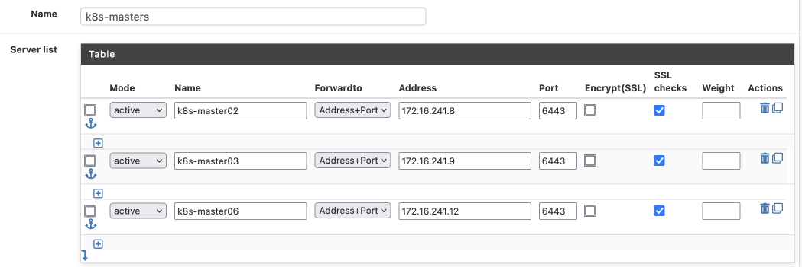
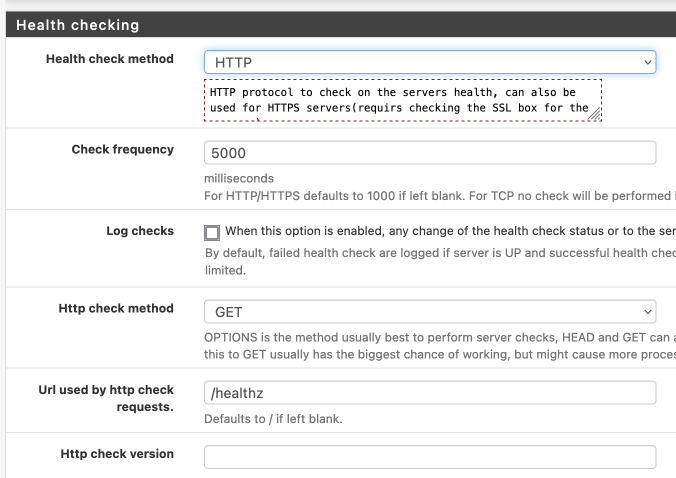
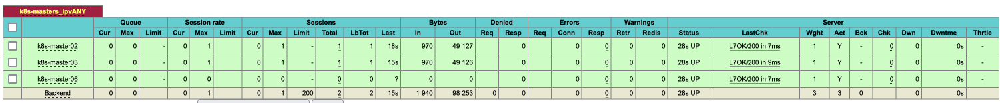

# HAProxy health checks against kube-apiserver

There are plenty of tutorials out there about how to run a highly-available kubernetes api-server behind haproxy. Without exception however, these tutorials configure haproxy to "check" the health of the backends with a simple TCP connection. These can produce a false sense of security though...

<!-- more -->

## Why is this a problem?

Just because the apiserver is responding on a TCP port, doesn't mean it's healthy, and sending API requests to an unhealthy apiserver is a very bad idea. Say for example, a particular apiserver's etcd backend was unhealthy - the apiserver would appear to be "healthy" to haproxy, and so it would receive kubelet / client traffic, but would return errors, bad data, or simply timeout.
How can we improve kube-apiserver health checks from HAProxy?

HAProxy is extremely versatile, and can perform a multitude of probes to determine the health of a backend. Kube-apiserver also exposes some health-check endpoints, like `/healthz` or `/readyz`. If we could configure haproxy to use an HTTP(s) check against the /healthz endpoint, we'd be able to be assured of only sending apiserver traffic to a healthy backend.

I initially tried to do this simply by pointing an HTTP check to `/healthz`, but kube-apiserver responded with a `403`, which haproxy took to be a failure. Reading the [haproxy blog post](https://www.haproxy.com/blog/how-to-enable-health-checks-in-haproxy/), it may be possible to simply configure haproxy to expect the `403`, and use this as an indication of a "healthy" endpoint:

```text
backend webservers
  option httpchk

  http-check connect
  http-check send meth GET uri /health
  http-check expect status 200

  http-check connect
  http-check send meth GET uri /health2
  http-check expect status 200

  server server1 192.168.50.2:80 check
  server server2 192.168.50.3:80 check
  server server3 192.168.50.4:80 check
```

This'd be better than a TCP health check, because at least it'd indicate that the apiserver was running, but it's still not ideal, because what if the `/healthz` actually reported that apiserver was unhealthy? Checking for a `403` would still result in traffic being sent to an unhealthy apiserver.

## Allowing anonymous auth

The most pragmatic solution I found was to allow anonymous auth on the kube-apisever, by adding `--anonymous-auth=true` to the apiserver arguments. This may be a controversial change, since it exposes the apiserver to enumeration, potential DOS, and exposes an additional attack vector if authn is misconfigured in other ways. [^1]

## What does allowing anonymous auth entail?

Per the [Kubernetes docs](https://kubernetes.io/docs/reference/access-authn-authz/authentication/#anonymous-requests):

> When enabled, requests that are not rejected by other configured authentication methods are treated as anonymous requests, and given a username of system:anonymous and a group of system:unauthenticated.

## HAProxy configuration for kube-apiserver healthz checks

Having made the security / availability tradeoff described above, I implemented this in haproxy on pfsense as illustrated below:



And I setup the health checks like this:



Once the backends are configured, the haproxy stats show their health as L7OK/200, as illustrated below:



[^1]: If the controlplane is secured and **not** exposed to the internet, then this is a worthwhile tradeoff, IMO

--8<-- "blog-footer.md"
