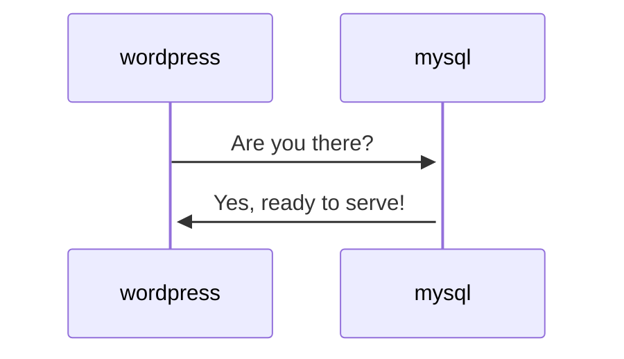
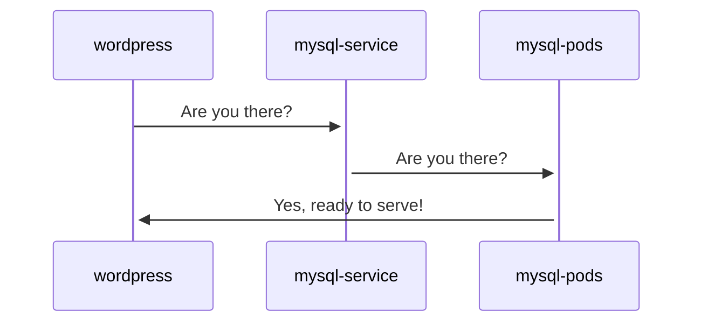

# Loadbalancing Services

## TL;DR

1. I have multiple nodes (*you'd benefit from [MetalLB](/kubernetes/loadbalancer/metallb/)*)
2. I only need/want one node (*just go with [k3s svclb](/kubernetes/loadbalancer/k3s/)*)

## But why?

In Kubernetes, you don't access your containers / pods "*directly*", other than for debugging purposes. Rather, we have a construct called a "*service*", which is "in front of" one or more pods.

Consider that this is how containers talk to each other under Docker Swarm:

But **this** is how containers (pods) talk to each other under Kubernetes:

Why do we do this?

1. A service isn't pinned to a particular node, it's a virtual IP which lives in the cluster and doesn't change as pods/nodes come and go.
2. Using a service "in front of" pods means that rolling updates / scaling of the pods can take place, but communication with the service is uninterrupted (*assuming correct configuration*).

Here's some [more technical detail](https://kubernetes.io/docs/concepts/services-networking/service/) into how it works, but what you need to know is that when you want to interact with your containers in Kubernetes (*either from other containers or from outside, as a human*), you'll be talking to **services.**

Also, services are not exposed outside of the cluster by default. There are 3 levels of "exposure" for your Kubernetes services, briefly:

1. ClusterIP (*A service is only available to other services in the cluster - this is the default*)
2. NodePort (*A mostly-random high-port on the node running the pod is forwarded to the pod*)[^1]
3. LoadBalancer (*Some external help is required to forward a particular IP into the cluster, terminating on the node running your pod*)

For anything vaguely useful, only `LoadBalancer` is a viable option. Even though `NodePort` may allow you to access services directly, who wants to remember that they need to access [Radarr][radarr] on `192.168.1.44:34542` and Homer on `192.168.1.44:34532`? Ugh.

Assuming you only had a single Kubernetes node (*say, a small k3s deployment*), you'd want 100% of all incoming traffic to be directed to that node, and so you wouldn't **need** a loadbalancer. You'd just point some DNS entries / firewall NATs at the IP of the cluster, and be done.

(*This is [the way k3s works](/kubernetes/loadbalancer/k3s/) by default, although it's still called a LoadBalancer*)



[^1]: It is possible to be prescriptive about which port is used for a Nodeport-exposed service, and this is occasionally [a valid deployment strategy](https://github.com/portainer/k8s/#using-nodeport-on-a-localremote-cluster), but you're usually limited to ports between 30000 and 32768.
