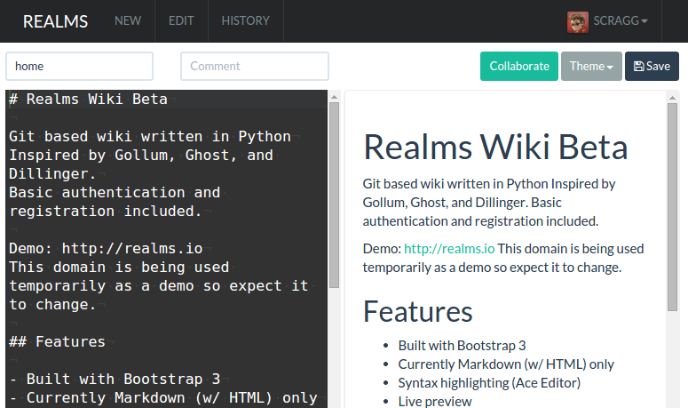

# Realms

Realms is a git-based wiki (_like [Gollum](/recipes/gollum/), but with basic authentication and registration_)

{ loading=lazy }

Features include:

* Built with Bootstrap 3.
* Markdown (w/ HTML Support).
* Syntax highlighting (Ace Editor).
* Live preview.
* Collaboration (TogetherJS / Firepad).
* Drafts saved to local storage.
* Handlebars for templates and logic.

!!! warning "Project likely abandoned"

    In my limited trial, Realms seems _less_ useful than [Gollum](/recipes/gollum/) for my particular use-case (_i.e., you're limited to markdown syntax only_), but other users may enjoy the basic user authentication and registration features, which Gollum lacks.

    Also of note is that the docker image is 1.17GB in size, and the handful of commits to the [source GitHub repo](https://github.com/scragg0x/realms-wiki/commits/master)  in the past year has listed TravisCI build failures. This has many of the hallmarks of an abandoned project, to my mind.

## {{ page.meta.recipe }} Requirements

--8<-- "recipe-standard-ingredients.md"

## Preparation

### Setup data locations

Since we'll start with a basic Realms install, let's just create a single directory to hold the realms (SQLite) data:

```bash
mkdir /var/data/realms/
```

### {{ page.meta.recipe }} Docker Swarm config

Create a docker swarm config file in docker-compose syntax (v3), something like the example below:

--8<-- "premix-cta.md"

```yaml
version: "3"

services:
  realms:
    image: realms/realms-wiki:latest
    volumes:
      - /var/data/realms:/home/wiki/data
    networks:
      - internal
      - traefik_public
    deploy:
      labels:
        # traefik common
        - traefik.enable=true
        - traefik.docker.network=traefik_public

        # traefikv1
        - traefik.frontend.rule=Host:realms.example.com
        - traefik.port=5000     

        # traefikv2
        - "traefik.http.routers.realms.rule=Host(`realms.example.com`)"
        - "traefik.http.services.realms.loadbalancer.server.port=5000"
        - "traefik.enable=true"

        # Remove if you wish to access the URL directly
        - "traefik.http.routers.realms.middlewares=forward-auth@file"


networks:
  traefik_public:
    external: true
  internal:
    driver: overlay
    ipam:
      config:
        - subnet: 172.16.35.0/24
```

--8<-- "reference-networks.md"

## Serving

### Launch Realms stack

Launch the Wekan stack by running ```docker stack deploy realms -c <path -to-docker-compose.yml>```

Log into your new instance at https://**YOUR-FQDN**, authenticate against oauth_proxy, and you're immediately presented with Realms wiki, waiting for a fresh edit ;)

[^1]: If you wanted to expose the realms UI directly, you could remove the traefik-forward-auth from the design.

[^2]: The inclusion of Realms was due to the efforts of @gkoerk in our [Discord server](http://chat.funkypenguin.co.nz)- Unfortunately on the 22nd August 2020 Jerry passed away. Jerry was very passionate and highly regarded in the field of Information Technology. He will be missed.

--8<-- "recipe-footer.md"
