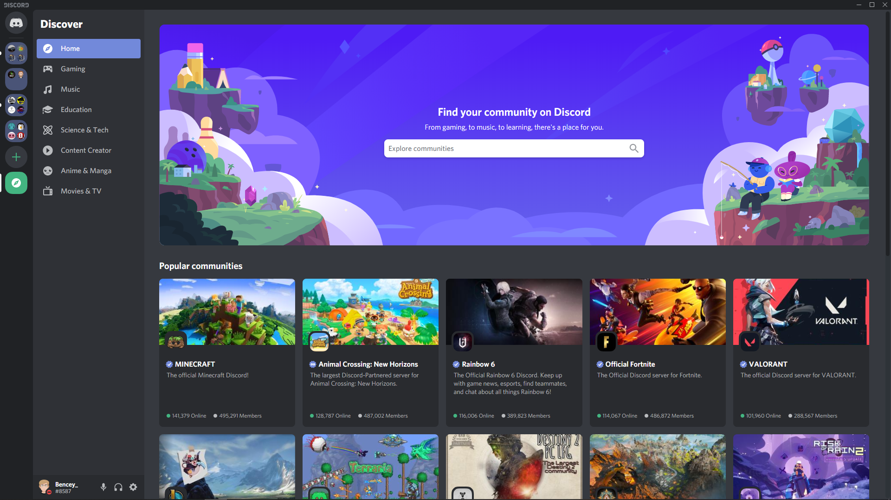

**A Beginners Guide to Discord**

**What is Discord?**

Discord is a free VoIP (Voice Over IP) application which is designed for creating communities. Discord specializes in text, voice, image, video and audio communication between users. You are able to install discord on Windows, MacOS, Linux, Android, IOS and web browsers. You are able to install discord and create an account [Here](https://discordapp.com)

**How do I use discord?**

When you log into discord for the first time you will be presented with this screen

In order to start using discord you will need to join your first server, You can join a server by clicking on the green + and clicking join a server, From there it will ask for the servers invite code, The invite code for Funky Penguins discord is [Here](https://discord.gg/R2NH7kZ). Once you join the server you will be presented with rooms called “Channels” When you click on a channel you will be able to start talking in that channel and everyone in the server will be able to talk to you. If you want to get the attention of a specific user you are able to poke (Formally known as a “mention”) By initially typing @ and then the username of the user so for example if you want to poke funky penguin you will type @funkypenguin Hello. When you start typing the username you will see names appearing above the text box, If you see the user you can click on the name and it will automatically type their name

**What If I want to privately talk to someone?**

In order to privately message someone you will first need to find the user on the members list (The list of people on the right). Once you find the person you will click on their name and you will see a text field saying “Message @user” From there you will start typing your message and when you are happy with your message you will click enter.

**Discord Markdown**
Discord supports markdown, If you are unaware of what markdown is markdown allows you to change the style of your message for example you can bold your message or you can underline it. If you want to learn how to use markdown you can read one of the guides that discord made on how to use markdown: https://support.discord.com/hc/en-us/articles/210298617-Markdown-Text-101-Chat-Formatting-Bold-Italic-Underline-

**What are each of the channels for?**

Each channel has a purpose, All of the channels in the discord have a correct way of using them and incorrect ways

Announcements- This is the announcements channel where funkypenguin will send important information.

Changelogs- This channel is used for changes to the website or discord.

Discourse- Messages from the discourse are posted here.

Cookbook-updates- When the cookbook is updated it will be posted here.

Premix-updates- When the gitlab is updated it will be posted here.

Introductions- In here you are able to introduce yourself to the server.

Live Geeking- When funkypenguin goes live it will be posted in here

General- Used for general day to day conversations

Suggestions- Used to post suggestions for the discord or the cookbook

Cookbook- Used for discussions around the cookbook

Dev- Used for conversations around development

Jobs- This channel is used if there are any jobs that need doing or if a certain company is hiring

Advertisements- In here you can advertise your services and websites

Til- Today I learnt, You can use this channel to post what you have learnt that day

**How do I suggest something?**

The first thing you will need to do is find the #suggestions channel in the discord. Next you will make sure that your suggestion has not been suggested before, if it has not been suggested then you will type the following message !suggest [Suggest] For example !suggest A guide on how to use discord. When you send the message a new message will appear with your suggestion where users can upvote or downvote your suggestion.

If there is something that is not listed in this guide but you cannot figure out you can head over to discords support center [Here](https://support.discord.com/hc/en-us) Where they have resources to help you.

	
