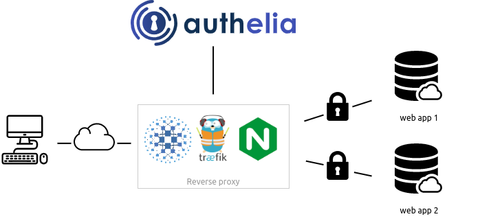
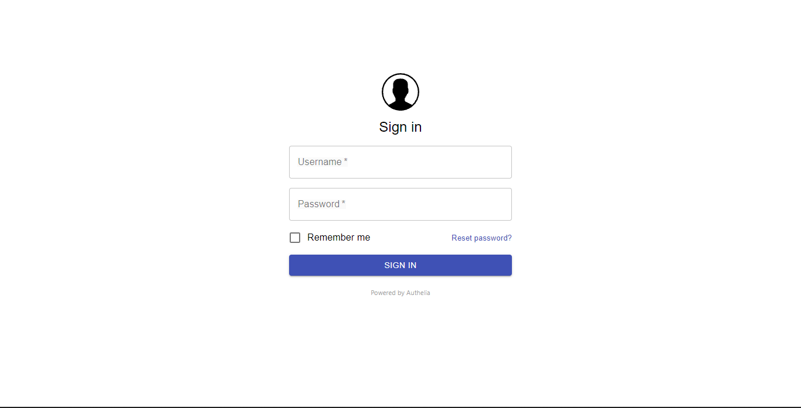

# Authelia

[Authelia](https://github.com/authelia/authelia) is an open-source authentication and authorization server providing 2-factor authentication and single sign-on (SSO) for your applications via a web portal. It acts as a companion of reverse proxies like Nginx, Traefik, or HAProxy to let them know whether queries should pass through. Unauthenticated users are redirected to Authelia Sign-in portal instead.



Features include

* Multiple two-factor methods such as
  * [Physical Security Key](https://www.authelia.com/docs/features/2fa/security-key) (Yubikey)
  * OTP using Google Authenticator
  * Mobile Notifications
* Lockout users after too many failed login attempts
* Highly Customizable Access Control using rules to match criteria such as subdomain, username, groups the user is in, and Network
* Authelia [Community](https://discord.authelia.com/) Support
* Full list of features can be viewed [here](https://www.authelia.com/docs/features/)

--8<-- "recipe-tfa-ingredients.md"

## Preparation

### Setup data locations

First, we create a directory to hold the data which authelia will serve:

```bash
mkdir /var/data/config/authelia
cd /var/data/config/authelia
```

### Create config file

Authelia configurations are defined in `/var/data/config/authelia/configuration.yml`. Some are required and some are optional. So begin by creating an empty configuration.yml file and add content to it as defined below. Optional configuration settings can be viewed on Authelia's [Documentation](https://www.authelia.com/docs/configuration/)

!!! warning
    Your variables may vary significantly from what's illustrated below, and it's best to read up and understand exactly what each option does.

```yml
###############################################################
#                   Authelia configuration                    #
###############################################################

server:
  host: 0.0.0.0
  port: 9091

log:
  level: warn

# This secret can also be set using the env variables AUTHELIA_JWT_SECRET_FILE
# I used this site to generate the secret: https://www.grc.com/passwords.htm
jwt_secret: SECRET_GOES_HERE

# https://docs.authelia.com/configuration/miscellaneous.html#default-redirection-url
default_redirection_url: https://auth.example.com

totp:
  issuer: authelia.com
  period: 30
  skew: 1

authentication_backend:
  file:
    path: /config/users_database.yml
    # customize passwords based on https://docs.authelia.com/configuration/authentication/file.html
    password:
      algorithm: argon2id
      iterations: 1
      salt_length: 16
      parallelism: 8
      memory: 1024 # blocks this much of the RAM. Tune this.

# https://docs.authelia.com/configuration/access-control.html
access_control:
  default_policy: one_factor
  rules:
    - domain: "*.example.com"
      policy: one_factor

    - domain: "bitwarden.example.com"
      policy: two_factor

session:
  name: authelia_session
  # This secret can also be set using the env variables AUTHELIA_SESSION_SECRET_FILE
  # Used a different secret, but the same site as jwt_secret above.
  secret: SECRET_GOES_HERE
  expiration: 3600 # 1 hour
  inactivity: 300 # 5 minutes
  domain: example.com # Should match whatever your root protected domain is

regulation:
  max_retries: 3
  find_time: 120
  ban_time: 300

storage:
  encryption_key: SECRET_GOES_HERE
  local:
    path: /config/db.sqlite3


notifier:
  smtp:
    username: SMTP_USERNAME
    # This secret can also be set using the env variables AUTHELIA_NOTIFIER_SMTP_PASSWORD_FILE
    # password: # use docker secret file instead AUTHELIA_NOTIFIER_SMTP_PASSWORD_FILE
    host: SMTP_HOST
    port: 587 #465
    sender: SENDER_EMAIL

# For testing purpose, notifications can be sent in a file. Be sure map the volume in docker-compose.
#  filesystem:
#    filename: /tmp/authelia/notification.txt

```

### Create User Accounts

Create `/var/data/config/authelia/users_database.yml` this will be where we can create user accounts and give them groups

```yaml
users:
  username:
    displayname: "Funky Penguin"
    password: "HASHED_PASSWORD"
    email: myemail@example.com
    groups:
      - admins
      - dev
```

To create a hashed password you can run the following command
`docker run authelia/authelia:latest authelia hash-password YOUR_PASSWORD`

### Setup Docker Swarm

Create a docker swarm config file in docker-compose syntax (v3), something like this:

--8<-- "premix-cta.md"

```yaml
version: "3.2"

services:
  authelia:
    image: authelia/authelia
    volumes:
      - /var/data/config/authelia:/config
    networks:
      - traefik_public
    deploy:
      labels:
        # traefik common
        - traefik.enable=true
        - traefik.docker.network=traefik_public

        # traefikv1
        - traefik.frontend.rule=Host:auth.example.com
        - traefik.port=80
        - 'traefik.frontend.auth.forward.address=http://authelia:9091/api/verify?rd=https://auth.example.com/'
        - 'traefik.frontend.auth.forward.trustForwardHeader=true'
        - 'traefik.frontend.auth.forward.authResponseHeaders=Remote-User,Remote-Groups,Remote-Name,Remote-Email'

        # traefikv2
        - "traefik.http.routers.authelia.rule=Host(`auth.example.com`)"
        - "traefik.http.routers.authelia.entrypoints=https"
        - "traefik.http.services.authelia.loadbalancer.server.port=9091"
        - "traefik.http.middlewares.authelia.forwardauth.address=http://authelia:9091/api/verify?rd=https://auth.example.com"
        - "traefik.http.middlewares.authelia.forwardauth.trustForwardHeader=true"
        - "traefik.http.middlewares.authelia.forwardauth.authResponseHeaders=Remote-User, Remote-Groups"

  # This simply validates that traefik forward authentication is working
  whoami:
    image: containous/whoami
    networks:
      - traefik_public
    deploy:
      labels:
        # traefik
        - "traefik.enable=true"
        - "traefik.docker.network=traefik_public"

        # traefikv1
        - "traefik.frontend.rule=Host:whoami.example.com"
        - "traefik.http.services.whoami.loadbalancer.server.port=80"
        - "traefik.frontend.auth.forward.address=http://authelia:9091/api/verify?rd=https://auth.example.com"
        - "traefik.frontend.auth.forward.authResponseHeaders=X-Forwarded-User"
        - "traefik.frontend.auth.forward.trustForwardHeader=true"

        # traefikv2
        - "traefik.http.routers.whoami.rule=Host(`whoami.example.com`)"
        - "traefik.http.routers.whoami.entrypoints=https"
        - "traefik.http.services.whoami.loadbalancer.server.port=80"
        - "traefik.http.routers.whoami.middlewares=forward-auth@file"


networks:
  traefik_public:
    external: true
```

### Traefik Configuration

Now that we have created authelia we will need to configure traefik so we can run authelia in front of our services. We will first need to create a traefik middleware in `/var/data/config/traefik/middlewares.yml`

```yaml
http:
  middlewares:
    forward-auth:
      forwardAuth:
        address: "http://authelia:9091/api/verify?rd=https://auth.example.com"
        trustForwardHeader: true
        authResponseHeaders:
          - "Remote-User"
          - "Remote-Groups"
```

We will then need to add the following to `traefik.toml`

```yaml
[providers.file]
  filename = "/etc/traefik/middlewares.yml"
```

!!! Why not just use Traefik Forward Auth
    The default Traefik forward Auth is a very minimal authentication service that provides google and openID authentication. Authelia provides more features such as multiple methods of authentication (Hardware, OTP, Email) and push notifications.

Now if we wish to put authelia behind a service all we will need to do is add the following to the labels

`- "traefik.http.routers.service.middlewares=forward-auth@file"`

## Serving

### Launch Authelia!

Launch the Authelia stack by running ```docker stack deploy authelia -c <path -to-docker-compose.yml>```

## Testing

To test the service works successfully. Try to access a service that you had added the middleware label to. If it works successfully you will be presented with a login screen



[^1]: The inclusion of Authelia was due to the efforts of @bencey in Discord (Thanks Ben!)

--8<-- "recipe-footer.md"
