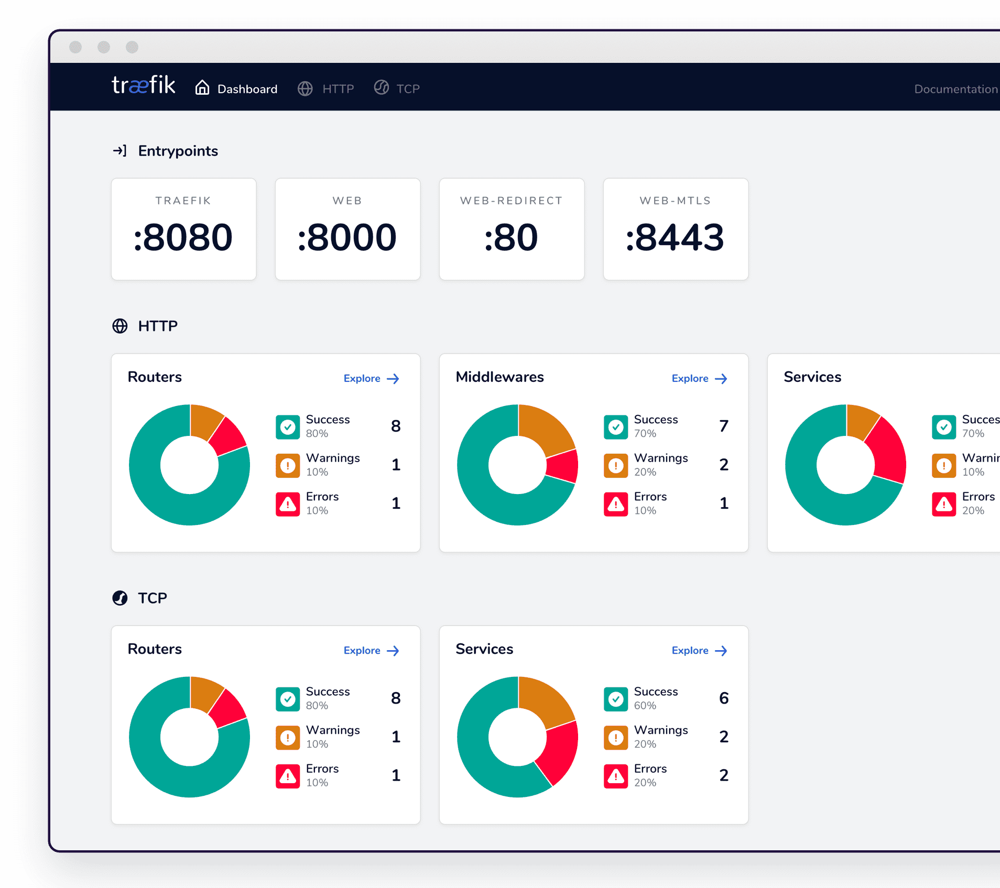

# Traefik Dashboard

One of the advantages [Traefik](/kubernetes/ingress/traefik/) offers over [Nginx](/kubernetes/ingress/nginx/), is a native dashboard available in the open-source version (*Nginx+, the commercially-supported version, also includes a dashboard*).

!!! summary "Ingredients"

    * [x] A [Kubernetes cluster](/kubernetes/cluster/) 
    * [x] [Flux deployment process](/kubernetes/deployment/flux/) bootstrapped
    * [x] A [load-balancer](/kubernetes/load-balancer/) solution (*either [k3s](/kubernetes/load-balancer/k3s/) or [MetalLB](/kubernetes/loadbalancer/metallb/)*)
    * [x] [Traefik](/kubernetes/ingress/traefik/) deployed per-design

--8<-- "recipe-footer.md"

[^1]: The beauty of this design is that the same process will now work for any other application you deploy, without any additional manual effort for DNS or SSL setup!
