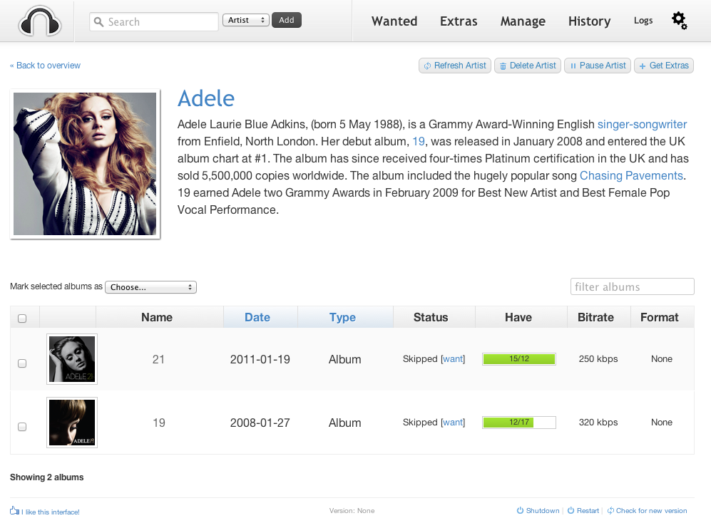

!!! warning
    This is not a complete recipe - it's a component of the [autopirate](/recipes/autopirate/) "_uber-recipe_", but has been split into its own page to reduce complexity.

# Headphones

[Headphones](https://github.com/rembo10/headphones) is an automated music downloader for NZB and Torrent, written in Python. It supports SABnzbd, NZBget, Transmission, µTorrent, Deluge and Blackhole.



## Inclusion into AutoPirate

To include Headphones in your [AutoPirate][autopirate] stack, include the following in your autopirate.yml stack definition file:

```yaml
headphones:
  image: linuxserver/headphones:latest
  env_file : /var/data/config/autopirate/headphones.env
  volumes:
   - /var/data/autopirate/headphones:/config
   - /var/data/media:/media
  networks:
  - internal

headphones_proxy:
  image: a5huynh/oauth2_proxy
  env_file : /var/data/config/autopirate/headphones.env
  networks:
    - internal
    - traefik_public
  deploy:
    labels:
      # traefik
      - traefik.enable=true
      - traefik.docker.network=traefik_public

      # traefikv1
      - traefik.frontend.rule=Host:headphones.example.com
      - traefik.port=8181
      - traefik.frontend.auth.forward.address=http://traefik-forward-auth:4181
      - traefik.frontend.auth.forward.authResponseHeaders=X-Forwarded-User
      - traefik.frontend.auth.forward.trustForwardHeader=true        

      # traefikv2
      - "traefik.http.routers.headphones.rule=Host(`headphones.example.com`)"
      - "traefik.http.routers.headphones.entrypoints=https"
      - "traefik.http.services.headphones.loadbalancer.server.port=8181"
      - "traefik.http.routers.headphones.middlewares=forward-auth"
```

--8<-- "premix-cta.md"
--8<-- "recipe-autopirate-toc.md"
--8<-- "recipe-footer.md"