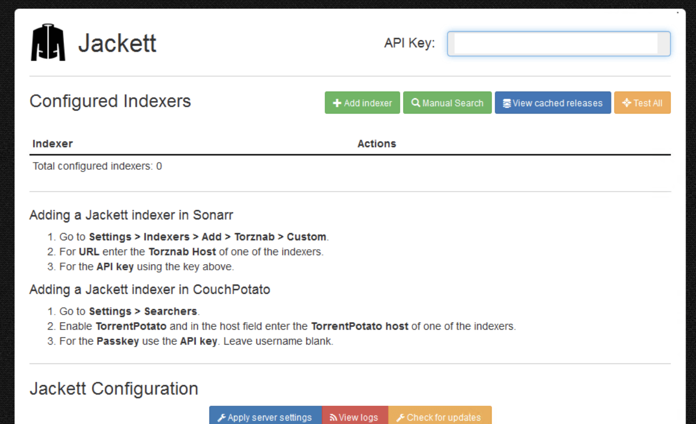

!!! warning
This is not a complete recipe - it's a component of the [autopirate](/recipes/autopirate/) "_uber-recipe_", but has been split into its own page to reduce complexity.

# Jackett

[Jackett](https://github.com/Jackett/Jackett) works as a proxy server: it translates queries from apps (*[Sonarr][sonarr], [Radarr][radarr], [Mylar][mylarr], etc*) into tracker-site-specific http queries, parses the html response, then sends results back to the requesting software.

This allows for getting recent uploads (like RSS) and performing searches. Jackett is a single repository of maintained indexer scraping & translation logic - removing the burden from other apps.



## Inclusion into AutoPirate

To include Jackett in your [AutoPirate](/recipes/autopirate/) stack, include the following in your autopirate.yml stack definition file:

```yaml
jackett:
  image: linuxserver/jackett:latest
  env_file : /var/data/config/autopirate/jackett.env
  volumes:
   - /var/data/autopirate/jackett:/config
  networks:
  - internal
  deploy:
    labels:
      # traefik
      - traefik.enable=true
      - traefik.docker.network=traefik_public

      # traefikv1
      - traefik.frontend.rule=Host:jackett.example.com
      - traefik.port=9117    
      - traefik.frontend.auth.forward.address=http://traefik-forward-auth:4181
      - traefik.frontend.auth.forward.authResponseHeaders=X-Forwarded-User
      - traefik.frontend.auth.forward.trustForwardHeader=true        

      # traefikv2
      - "traefik.http.routers.jackett.rule=Host(`jackett.example.com`)"
      - "traefik.http.routers.jackett.entrypoints=https"
      - "traefik.http.services.jackett.loadbalancer.server.port=9117"
      - "traefik.http.routers.jackett.middlewares=forward-auth"

```

--8<-- "premix-cta.md"
--8<-- "recipe-autopirate-toc.md"
--8<-- "recipe-footer.md"