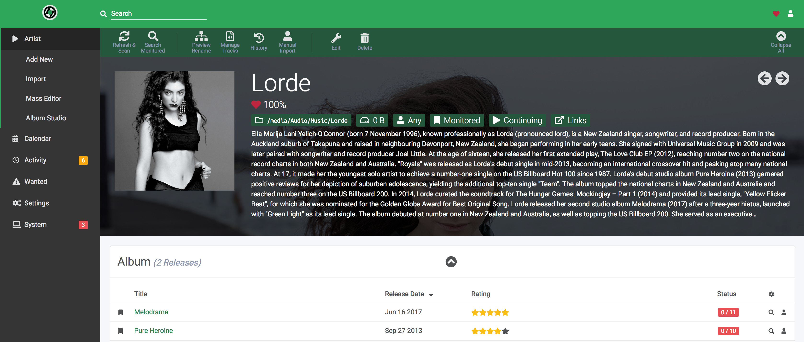

hero: AutoPirate - A fully-featured recipe to automate finding, downloading, and organising your media 📺 🎥 🎵 📖

!!! warning
    This is not a complete recipe - it's a component of the [autopirate](/recipes/autopirate/) "_uber-recipe_", but has been split into its own page to reduce complexity.

# Lidarr

[Lidarr](https://lidarr.audio/) is an automated music downloader for NZB and Torrent. It performs the same function as [Headphones](/recipes/autopirate/headphones), but is written using the same(ish) codebase as [Radarr](/recipes/autopirate/radarr/) and [Sonarr](/recipes/autopirate/sonarr). It's blazingly fast, and includes beautiful album/artist art. Lidarr supports [SABnzbd](/recipes/autopirate/sabnzbd/), [NZBGet](/recipes/autopirate/nzbget/), Transmission, µTorrent, Deluge and Blackhole (_just like Sonarr / Radarr_)



## Inclusion into AutoPirate

To include Lidarr in your [AutoPirate](/recipes/autopirate/) stack, include the following in your autopirate.yml stack definition file:

````yaml
  lidarr:
    image: linuxserver/lidarr:latest
    env_file: /var/data/config/lidarr/lidarr.env
    volumes:
      - /etc/localtime:/etc/localtime:ro
      - /var/data/media:/media
      - /var/data/lidarr:/config
    deploy:
      replicas: 1
      labels:
        # traefik
        - traefik.enable=true
        - traefik.docker.network=traefik_public

        # traefikv1
        - traefik.frontend.rule=Host:lidarr.example.com
        - traefik.port=8686
        - traefik.frontend.auth.forward.address=http://traefik-forward-auth:4181
        - traefik.frontend.auth.forward.authResponseHeaders=X-Forwarded-User
        - traefik.frontend.auth.forward.trustForwardHeader=true        

        # traefikv2
        - "traefik.http.routers.lidarr.rule=Host(`lidarr.example.com`)"
        - "traefik.http.routers.lidarr.entrypoints=https"
        - "traefik.http.services.lidarr.loadbalancer.server.port=8686"
        - "traefik.http.routers.lidarr.middlewares=forward-auth"
````

--8<-- "premix-cta.md"
--8<-- "recipe-autopirate-toc.md"
--8<-- "recipe-footer.md"
