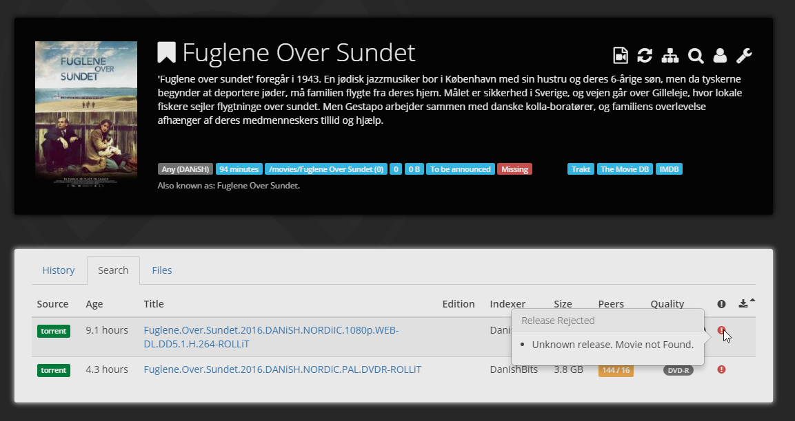

!!! warning
    This is not a complete recipe - it's a component of the [AutoPirate](/recipes/autopirate/) "_uber-recipe_", but has been split into its own page to reduce complexity.

# Radarr


[Radarr](https://radarr.video/) is a tool for finding, downloading and managing movies. Features include:

* Adding new movies with lots of information, such as trailers, ratings, etc.
* Can watch for better quality of the movies you have and do an automatic upgrade. eg. from DVD to Blu-Ray
* Automatic failed download handling will try another release if one fails
* Manual search so you can pick any release or to see why a release was not downloaded automatically
* Full integration with SABnzbd and NZBGet
* Automatically searching for releases as well as RSS Sync
* Automatically importing downloaded movies
* Recognizing Special Editions, Director's Cut, etc.
* Identifying releases with hardcoded subs
* Importing movies from various online sources, such as IMDb Watchlists (A complete list can be found here)
* Full integration with Kodi, Plex (notification, library update)
* And a beautiful UI
* Importing Metadata such as trailers or subtitles



## Inclusion into AutoPirate

To include Radarr in your [AutoPirate][autopirate] stack, include the following in your autopirate.yml stack definition file:

```yaml
radarr:
  image: linuxserver/radarr:latest
  env_file : /var/data/config/autopirate/radarr.env
  volumes:
   - /var/data/autopirate/radarr:/config
   - /var/data/media:/media
  networks:
  - internal
  deploy:
    labels:
      # traefik
      - traefik.enable=true
      - traefik.docker.network=traefik_public

      # traefikv1
      - traefik.frontend.rule=Host:radarr.example.com
      - traefik.port=7878
      - traefik.frontend.auth.forward.address=http://traefik-forward-auth:4181
      - traefik.frontend.auth.forward.authResponseHeaders=X-Forwarded-User
      - traefik.frontend.auth.forward.trustForwardHeader=true        

      # traefikv2
      - "traefik.http.routers.radarr.rule=Host(`radarr.example.com`)"
      - "traefik.http.routers.radarr.entrypoints=https"
      - "traefik.http.services.radarr.loadbalancer.server.port=7878"
      - "traefik.http.routers.radarr.middlewares=forward-auth"
```

--8<-- "premix-cta.md"
--8<-- "recipe-autopirate-toc.md"
--8<-- "recipe-footer.md"