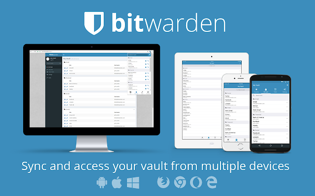

# Bitwarden

Heard about the [latest password breach](https://www.databreaches.net) (*since lunch*)? [HaveYouBeenPowned](http://haveibeenpwned.com) yet (*today*)? [Passwords are broken](https://www.theguardian.com/technology/2008/nov/13/internet-passwords), and as the amount of sites for which you need to store credentials grows exponetially, so does the risk of using a common password.

"*Duh, use a password manager*", you say. Sure, but be aware that [even password managers have security flaws](https://www.securityevaluators.com/casestudies/password-manager-hacking/).

**OK, look smartass..** no software is perfect, and there will always be a risk of your credentials being exposed in ways you didn't intend. You can at least **minimize** the impact of such exposure by using a password manager to store unique credentials per-site. While [1Password](http://1password.com) is king of the commercial password manager, [BitWarden](https://bitwarden.com) is king of the open-source, self-hosted password manager.

Enter Bitwarden..



Bitwarden is a free and open source password management solution for individuals, teams, and business organizations. While Bitwarden does offer a paid / hosted version, the free version comes with the following (*better than any other free password manager!*):

* Access & install all Bitwarden apps
* Sync all of your devices, no limits!
* Store unlimited items in your vault
* Logins, secure notes, credit cards, & identities
* Two-step authentication (2FA)
* Secure password generator
* Self-host on your own server (optional)

--8<-- "recipe-standard-ingredients.md"

## Preparation

### Setup data locations

We'll need to create a directory to bind-mount into our container, so create `/var/data/bitwarden`:

```
mkdir /var/data/bitwarden
```
### Setup environment

Create `/var/data/config/bitwarden/bitwarden.env`, and **leave it empty for now**.

!!! question
    What, why an empty env file? Well, the container supports lots of customizations via environment variables, for things like toggling self-registration, 2FA, etc. These are too complex to go into for this recipe, but readers are recommended to review the [dani-garcia/bitwarden_rs wiki](https://github.com/dani-garcia/bitwarden_rs), and customize their installation to suite.

### Setup Docker Swarm

Create a docker swarm config file in docker-compose syntax (v3), something like this:

--8<-- "premix-cta.md"

```yaml
version: "3"
services:
  bitwarden:
    image: bitwardenrs/server
    env_file: /var/data/config/bitwarden/bitwarden.env
    volumes:
      - /etc/localtime:/etc/localtime:ro
      - /var/data/bitwarden:/data/:rw
    deploy:
      labels:
        - traefik.enable=true
        - traefik.web.frontend.rule=Host:bitwarden.example.com
        - traefik.web.port=80
        - traefik.hub.frontend.rule=Host:bitwarden.example.com;Path:/notifications/hub
        - traefik.hub.port=3012
        - traefik.docker.network=traefik_public
    networks:
        - traefik_public

networks:
  traefik_public:
    external: true
```

!!! note
    Note the clever use of two Traefik frontends to expose the notifications hub on port 3012. Thanks @gkoerk!


## Serving

### Launch Bitwarden stack

Launch the Bitwarden stack by running ```docker stack deploy bitwarden -c <path -to-docker-compose.yml>```

Browse to your new instance at https://**YOUR-FQDN**, and create a new user account and master password (*Just click the **Create Account** button without filling in your email address or master password*)

### Get the apps / extensions

Once you've created your account, jump over to https://bitwarden.com/#download and download the apps for your mobile and browser, and start adding your logins!

[^1]: You'll notice we're not using the *official* container images (*[all 6 of them required](https://help.bitwarden.com/article/install-on-premise/#install-bitwarden)!)*, but rather a [more lightweight version ideal for self-hosting](https://hub.docker.com/r/bitwardenrs/server). All of the elements are contained within a single container, and SQLite is used for the database backend.
[^2]: As mentioned above, readers should refer to the [dani-garcia/bitwarden_rs wiki](https://github.com/dani-garcia/bitwarden_rs) for details on customizing the behaviour of Bitwarden.
[^3]: The inclusion of Bitwarden was due to the efforts of @gkoerk in our [Discord server](http://chat.funkypenguin.co.nz)- Thanks Gerry!

--8<-- "recipe-footer.md"