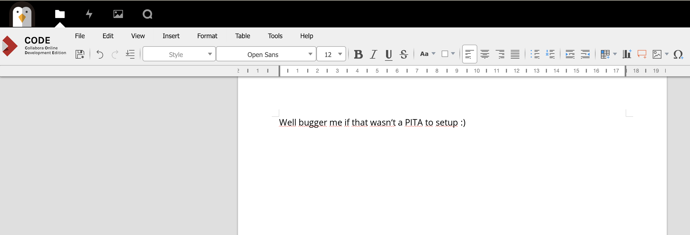
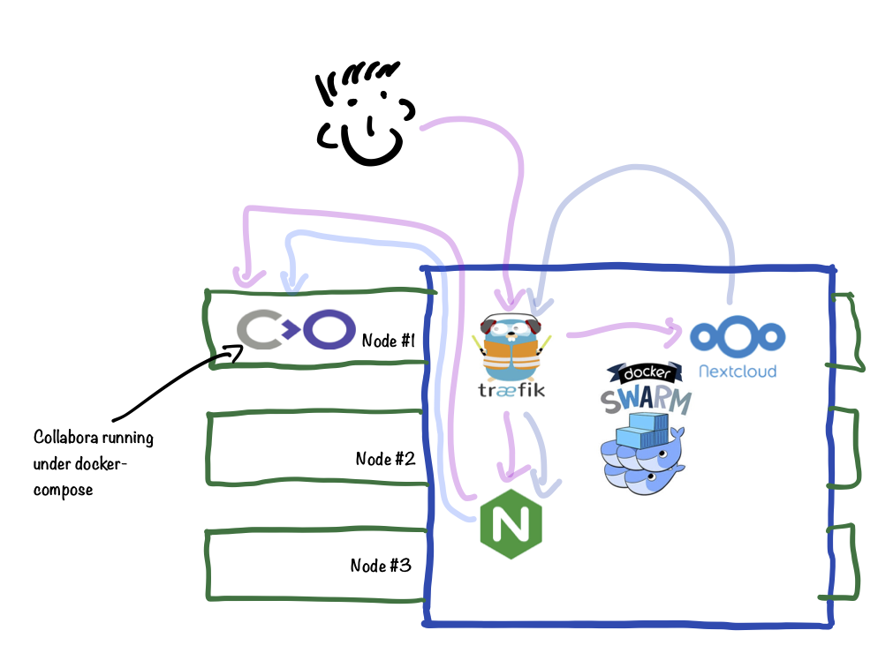
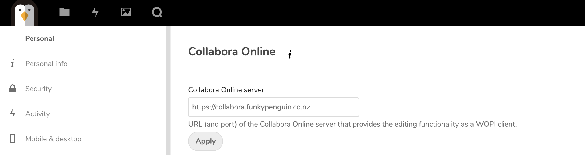

# Collabora Online

Collabora Online Development Edition (or "[CODE](https://www.collaboraoffice.com/code/#what_is_code)"), is the lightweight, or "home" edition of the commercially-supported [Collabora Online](https://www.collaboraoffice.com/collabora-online/) platform. It

It's basically the [LibreOffice](https://www.libreoffice.org/) interface in a web-browser. CODE is not a standalone app, it's a backend intended to be accessed via "WOPI" from an existing interface (_in our case, [NextCloud](/recipes/nextcloud/)_)



## Ingredients

1. [Docker swarm cluster](/ha-docker-swarm/design/) with [persistent shared storage](/ha-docker-swarm/shared-storage-ceph.md)
2. [Traefik](/ha-docker-swarm/traefik) configured per design
3. DNS entry for the hostname (_i.e. "collabora.your-domain.com"_) you intend to use for LDAP Account Manager, pointed to your [keepalived](/ha-docker-swarm/keepalived/) IP
4. [NextCloud](/recipes/nextcloud/) installed and operational
5. [Docker-compose](https://docs.docker.com/compose/install/) installed on your node(s) - this is a special case which needs to run outside of Docker Swarm

## Preparation

### Explanation for complexity

Due to the clever magic that Collabora does to present a "headless" LibreOffice UI to the browser, the CODE docker container requires system capabilities which cannot be granted under Docker Swarm (_specifically, MKNOD_).

So we have to run Collabora itself in the next best thing to Docker swarm - a docker-compose stack. Using docker-compose will at least provide us with consistent and version-able configuration files.

This presents another problem though - Docker Swarm with Traefik is superb at making all our stacks "just work" with ingress routing and LetsEncyrpt certificates. We don't want to have to do this manually (_like a cave-man_), so we engage in some trickery to allow us to still use our swarmed Traefik to terminate SSL.

We run a single swarmed Nginx instance, which forwards all requests to an upstream, with the target IP of the docker0 interface, on port 9980 (_the port exposed by the CODE container_)

We attach the necessary labels to the Nginx container to instruct Trafeik to setup a front/backend for collabora.<ourdomain\>. Now incoming requests to **https://collabora.<ourdomain\>** will hit Traefik, be forwarded to nginx (_wherever in the swarm it's running_), and then to port 9980 on the same node that nginx is running on.

What if we're running multiple nodes in our swarm, and nginx ends up on a different node to the one running Collabora via docker-compose? Well, either constrain nginx to the same node as Collabora (_example below_), or just launch an instance of Collabora on _every_ node then. It's just a rendering / GUI engine after all, it doesn't hold any persistent data.

Here's a (_highly technical_) diagram to illustrate:



### Setup data locations

We'll need a directory for holding config to bind-mount into our containers, so create ```/var/data/collabora```, and ```/var/data/config/collabora``` for holding the docker/swarm config

```
mkdir /var/data/collabora/
mkdir /var/data/config/collabora/
```

### Prepare environment

Create /var/data/config/collabora/collabora.env, and populate with the following variables, customized for your installation.

!!! warning
    Note the following:

    1. Variables are in lower-case, unlike our standard convention. This is to align with the CODE container
    2. Set domain to your [NextCloud](/recipes/nextcloud/) domain, and escape all the periods as per the example
    3. Set your server_name to collabora.<yourdomain\>. Escaping periods is unnecessary
    4. Your password cannot include triangular brackets - the entrypoint script will insert this password into an XML document, and triangular brackets will make bad(tm) things happen 🔥

```
username=admin
password=ilovemypassword
domain=nextcloud\.batcave\.com
server_name=collabora.batcave.com
termination=true
```

### Create docker-compose.yml

Create ```/var/data/config/collabora/docker-compose.yml``` as follows:

```yaml
version: "3.0"

services:
  local-collabora:
    image: funkypenguin/collabora
    # the funkypenguin version has a patch to include "termination" behind SSL-terminating reverse proxy (traefik), see CODE PR #50.
    # Once merged, the official container can be used again.
    #image: collabora/code
    env_file: /var/data/config/collabora/collabora.env
    volumes:
      - /var/data/collabora/loolwsd.xml:/etc/loolwsd/loolwsd.xml-new
    cap_add:
      - MKNOD
    ports:
      - 9980:9980
```

### Create nginx.conf

Create ```/var/data/config/collabora/nginx.conf``` as follows, changing the ```server_name``` value to match the environment variable you established above:


```
upstream collabora-upstream {
    # Run collabora under docker-compose, since it needs MKNOD cap, which can't be provided by Docker Swarm.
    # The IP here is the typical IP of docker0 - change if yours is different.
    server 172.17.0.1:9980;
}

server {
    listen 80;
    server_name collabora.batcave.com;

    # static files
    location ^~ /loleaflet {
        proxy_pass http://collabora-upstream;
        proxy_set_header Host $http_host;
    }

    # WOPI discovery URL
    location ^~ /hosting/discovery {
        proxy_pass http://collabora-upstream;
        proxy_set_header Host $http_host;
    }

    # Main websocket
    location ~ /lool/(.*)/ws$ {
        proxy_pass http://collabora-upstream;
        proxy_set_header Upgrade $http_upgrade;
        proxy_set_header Connection "Upgrade";
        proxy_set_header Host $http_host;
        proxy_read_timeout 36000s;
    }

    # Admin Console websocket
    location ^~ /lool/adminws {
	proxy_buffering off;
        proxy_pass http://collabora-upstream;
        proxy_set_header Upgrade $http_upgrade;
        proxy_set_header Connection "Upgrade";
        proxy_set_header Host $http_host;
        proxy_read_timeout 36000s;
    }

    # download, presentation and image upload
    location ~ /lool {
        proxy_pass https://collabora-upstream;
        proxy_set_header Host $http_host;
    }
}

```

### Create loolwsd.xml

[Until we understand](https://github.com/CollaboraOnline/Docker-CODE/pull/50) how to [pass trusted network parameters to the entrypoint script using environment variables](https://github.com/CollaboraOnline/Docker-CODE/issues/49), we have to maintain a manually edited version of ```loolwsd.xml```, and bind-mount it into our collabora container.

The way we do this is we mount
`/var/data/collabora/loolwsd.xml` as `/etc/loolwsd/loolwsd.xml-new`, then allow the container to create its default `/etc/loolwsd/loolwsd.xml`, copy this default **over** our `/var/data/collabora/loolwsd.xml` as `/etc/loolwsd/loolwsd.xml-new`, and then update the container to use **our** `/var/data/collabora/loolwsd.xml` as `/etc/loolwsd/loolwsd.xml` instead (_confused yet?_)

Create an empty `/var/data/collabora/loolwsd.xml` by running `touch /var/data/collabora/loolwsd.xml`. We'll populate this in the next section...

### Setup Docker Swarm

Create `/var/data/config/collabora/collabora.yml` as follows, changing the traefik frontend_rule as necessary:

--8<-- "premix-cta.md"

```
version: "3.0"

services:

  nginx:
    image: nginx:latest
    networks:
      - traefik_public
    deploy:
      labels:
        - traefik.frontend.rule=Host:collabora.batcave.com
        - traefik.docker.network=traefik_public
        - traefik.port=80
        - traefik.frontend.passHostHeader=true
        # uncomment this line if you want to force nginx to always run on one node (i.e., the one running collabora)
      #placement:
      #  constraints:
      #     - node.hostname == ds1
    volumes:
      - /var/data/collabora/nginx.conf:/etc/nginx/conf.d/default.conf:ro

networks:
  traefik_public:
    external: true
```

## Serving

### Generate loolwsd.xml

Well. This is awkward. There's no documented way to make Collabora work with Docker Swarm, so we're doing a bit of a hack here, until I understand [how to pass these arguments](https://github.com/CollaboraOnline/Docker-CODE/issues/49) via environment variables.

Launching Collabora is (_for now_) a 2-step process. First.. we launch collabora itself, by running:

```
cd /var/data/config/collabora/
docker-compose -d up
```

Output looks something like this:

```
root@ds1:/var/data/config/collabora# docker-compose up -d
WARNING: The Docker Engine you're using is running in swarm mode.

Compose does not use swarm mode to deploy services to multiple nodes in a swarm. All containers will be scheduled on the current node.

To deploy your application across the swarm, use `docker stack deploy`.

Pulling local-collabora (funkypenguin/collabora:latest)...
latest: Pulling from funkypenguin/collabora
7b8b6451c85f: Pull complete
ab4d1096d9ba: Pull complete
e6797d1788ac: Pull complete
e25c5c290bde: Pull complete
4b8e1b074e06: Pull complete
f51a3d1fb75e: Pull complete
8b826e2ae5ad: Pull complete
Digest: sha256:6cd38cb5cbd170da0e3f0af85cecf07a6bc366e44555c236f81d5b433421a39d
Status: Downloaded newer image for funkypenguin/collabora:latest
Creating collabora_local-collabora_1 ...
Creating collabora_local-collabora_1 ... done
root@ds1:/var/data/config/collabora#
```

Now exec into the container (_from another shell session_), by running ```exec <container name> -it /bin/bash```. Make a copy of /etc/loolwsd/loolwsd, by running ```cp /etc/loolwsd/loolwsd.xml /etc/loolwsd/loolwsd.xml-new```, and then exit the container with ```exit```.

Delete the collabora container by hitting CTRL-C in the docker-compose shell, running ```docker-compose rm```, and then altering this line in docker-compose.yml:

```
      - /var/data/collabora/loolwsd.xml:/etc/loolwsd/loolwsd.xml-new
```

To this:

```
      - /var/data/collabora/loolwsd.xml:/etc/loolwsd/loolwsd.xml
```

Edit /var/data/collabora/loolwsd.xml, find the **storage.filesystem.wopi** section, and add lines like this to the existing allow rules (_to allow IPv6-enabled hosts to still connect with their IPv4 addreses_):

```
<host desc="Regex pattern of hostname to allow or deny." allow="true">::ffff:10\.[0-9]{1,3}\.[0-9]{1,3}\.[0-9]{1,3}</host>
<host desc="Regex pattern of hostname to allow or deny." allow="true">::ffff:172\.1[6789]\.[0-9]{1,3}\.[0-9]{1,3}</host>
<host desc="Regex pattern of hostname to allow or deny." allow="true">::ffff:172\.2[0-9]\.[0-9]{1,3}\.[0-9]{1,3}</host>
<host desc="Regex pattern of hostname to allow or deny." allow="true">::ffff:172\.3[01]\.[0-9]{1,3}\.[0-9]{1,3}</host>
<host desc="Regex pattern of hostname to allow or deny." allow="true">::ffff:192\.168\.[0-9]{1,3}\.[0-9]{1,3}</host>
```

Find the **net.post_allow** section, and add a line like this:

```
<host desc="RFC1918 private addressing in inet6 format">::ffff:10\.[0-9]{1,3}\.[0-9]{1,3}\.[0-9]{1,3}</host>
<host desc="RFC1918 private addressing in inet6 format">::ffff:172\.1[6789]\.[0-9]{1,3}\.[0-9]{1,3}</host>
<host desc="RFC1918 private addressing in inet6 format">::ffff:172\.2[0-9]\.[0-9]{1,3}\.[0-9]{1,3}</host>
<host desc="RFC1918 private addressing in inet6 format">::ffff:172\.3[01]\.[0-9]{1,3}\.[0-9]{1,3}</host>
<host desc="RFC1918 private addressing in inet6 format">::ffff:192\.168\.[0-9]{1,3}\.[0-9]{1,3}</host>            
```

Find these 2 lines:

```
<ssl desc="SSL settings">
    <enable type="bool" default="true">true</enable>
```

And change to:

```
<ssl desc="SSL settings">
    <enable type="bool" default="true">false</enable>
```

Now re-launch collabora (_with the correct with loolwsd.xml_) under docker-compose, by running:

```
docker-compose -d up
```

Once collabora is up, we launch the swarm stack, by running:

```
docker stack deploy collabora -c /var/data/config/collabora/collabora.yml
```

Visit **https://collabora.<yourdomain\>/l/loleaflet/dist/admin/admin.html** and confirm you can login with the user/password you specified in collabora.env

### Integrate into NextCloud

In NextCloud, Install the **Collabora Online** app (https://apps.nextcloud.com/apps/richdocuments), and then under **Settings -> Collabora Online**, set your Collabora Online Server to ```https://collabora.<your domain>```



Now browse your NextCloud files. Click the plus (+) sign to create a new document, and create either a new document, spreadsheet, or presentation. Name your document and then click on it. If Collabora is setup correctly, you'll shortly enter into the rich editing interface provided by Collabora :)

[^1]: Yes, this recipe is complicated. And you probably only care if you feel strongly about using Open Source rich document editing in the browser, vs using something like Google Docs. It works impressively well however, once it works. I hope to make this recipe simpler once the CODE developers have documented how to pass optional parameters as environment variables.

--8<-- "recipe-footer.md"