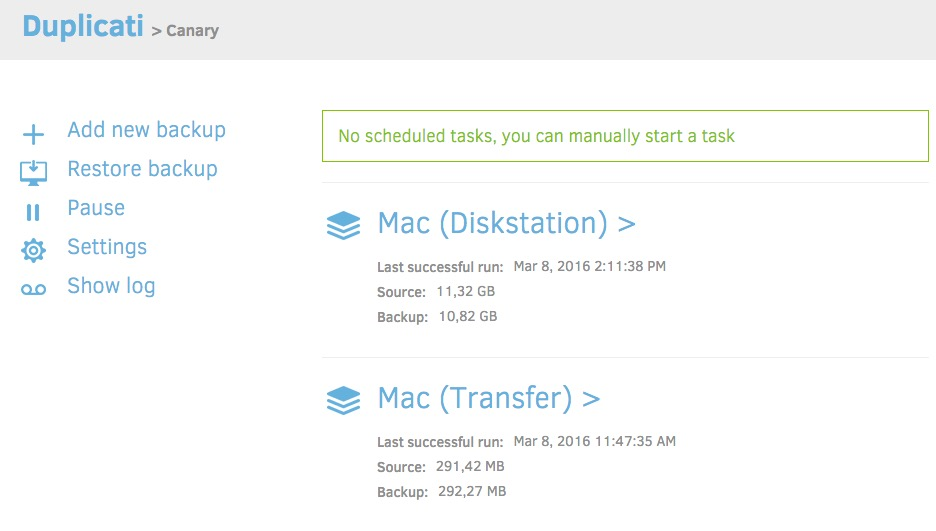

hero: Duplicati - Yet another option to backup your exciting stuff. It's good to have options.

# Duplicati

Always have a backup plan[^1]




[Duplicati](https://www.duplicati.com/) is a free and open-source backup software to store encrypted backups online For Windows, macOS and Linux (our favorite, yay!).

Similar to the other backup options in the Cookbook, we can use Duplicati to backup all our data-at-rest to a wide variety of locations, including, but not limited to:

- Generic endpoints (FTP, SSH, or WebDAV servers)
- Cloud storage providers (Amazon S3, BackBlaze B2, etc)
- Cloud services (OneDrive, Google Drive, etc)

!!! note
    Since Duplicati itself offers no user authentication, this design secures Duplicati behind [Traefik Forward Auth](/ha-docker-swarm/traefik-forward-auth), so that in order to gain access to the Duplicati UI at all,  authentication through the mechanism configured in traefik-forward-auth (_to GitHub, GitLab, Google, etc_) must have already occurred.

## Ingredients

!!! summary "Ingredients"
    * [X] [Docker swarm cluster](/ha-docker-swarm/design/) with [persistent shared storage](/ha-docker-swarm/shared-storage-ceph.md)
    * [X] [Traefik](/ha-docker-swarm/traefik) and [Traefik-Forward-Auth](/ha-docker-swarm/traefik-forward-auth) configured per design
    * [X] Credentials for one of the Duplicati's supported upload destinations

## Preparation

### Setup data locations

We'll need a folder to store a docker-compose configuration file and an associated environment file. If you're following my filesystem layout, create `/var/data/config/duplicati` (*for the config*), and `/var/data/duplicati` (*for the metadata*) as follows:

```
mkdir /var/data/config/duplicati
mkdir /var/data/duplicati
cd /var/data/config/duplicati
```

### Prepare environment

1. Generate a random passphrase to use to encrypt your data. **Save this somewhere safe**, without it you won't be able to restore!
2. Seriously, **save**. **it**. **somewhere**. **safe**.
3. Create `duplicati.env`, and populate with the following variables (_replace "Europe/London" with your appropriate time zone from [this list](https://en.wikipedia.org/wiki/List_of_tz_database_time_zones)_)
```
PUID=0
PGID=0
TZ=Europe/London
CLI_ARGS= #optional
```

!!! question "Excuse me! Why are we running Duplicati as root?"
    That's a great question! We're running Duplicati as the `root` user of the host system because we need Duplicati to be able to read files of all the other services no matter which user that service is running as. After all, Duplicati can't backup your exciting stuff if it can't read the files.


### Setup Docker Swarm

Create a docker swarm config file in docker-compose syntax (v3), something like this:

--8<-- "premix-cta.md"

```yaml
version: "3"
services:
  duplicati:
    image: linuxserver/duplicati
    env_file: /var/data/config/duplicati/duplicati.env
    deploy:
      replicas: 1
      labels:
        - traefik.enable=true
        - traefik.frontend.rule=Host:duplicati.example.com
        - traefik.port=8200
        - traefik.frontend.auth.forward.address=http://traefik-forward-auth:4181
        - traefik.frontend.auth.forward.authResponseHeaders=X-Forwarded-User
        - traefik.frontend.auth.forward.trustForwardHeader=true
        - traefik.docker.network=traefik_public
    volumes:
      - /var/data/config/duplicati:/config
      - /var/data:/source
    ports:
      - 8200:8200
    networks:
      - traefik_public
      - internal

networks:
  traefik_public:
    external: true
  internal:
    driver: overlay
    ipam:
      config:
        - subnet: 172.16.55.0/24
```

--8<-- "reference-networks.md"

## Serving

### Launch Duplicati stack

Launch the Duplicati stack by running ```docker stack deploy duplicati -c <path-to-docker-compose.yml>```

### Create (and verify!) Your First Backup
Once we authenticate through the traefik-forward-auth provider, we can start configuring your backup jobs via the Duplicati UI. All backup and restore job configuration is done through the UI. Be sure to read through the documentation on [Creating a new backup job](https://duplicati.readthedocs.io/en/latest/03-using-the-graphical-user-interface/#creating-a-new-backup-job) and [Restoring files from a backup](https://duplicati.readthedocs.io/en/latest/03-using-the-graphical-user-interface/#restoring-files-from-a-backup) for information on how to configure those jobs. 

!!! warning
    An untested backup is not really a backup at all. Being ***sure*** you can succesfully restore files from your backup now could save you lots of heartache later after "something bad" happens.

!!! tip
    Backing up files on a regular basis is going to use a continually-increasing amount of disk space. To help with this, Duplicati offers a "Smart Backup Retention" scheme that will intelligently remove certain backups as they age while still maintaining a comprehensive backup history. You can set that configuration on the "Options" tab of the backup configuration.

[^1]: Quote attributed to Mila Kunis
[^2]: The [Duplicati 2 User's Manual](https://duplicati.readthedocs.io/en/latest/) contains all the information you'll need to configure backup endpoints, restore jobs, scheduling and advanced properties for your backup jobs.

--8<-- "recipe-footer.md"