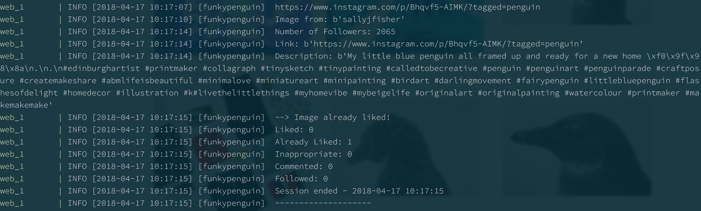

# InstaPy

[InstaPy](https://github.com/timgrossmann/InstaPy) is an Instagram bot, developed by [Tim Grossman](https://github.com/timgrossmann). Tim describes his motivation and experiences developing the bot [here](https://medium.freecodecamp.org/my-open-source-instagram-bot-got-me-2-500-real-followers-for-5-in-server-costs-e40491358340).

What's an Instagram bot? Basically, you feed the bot your Instagram user/password, and it executes follows/unfollows/likes/comments on your behalf based on rules you set. (_I set my bot to like one photo tagged with "[#penguin](https://www.instagram.com/explore/tags/penguin/?hl=en)" per-run_)



Great power, right? A client (_yes, you can [hire](https://www.funkypenguin.co.nz/) me!_) asked me to integrate InstaPy into their swarm, and this recipe is the result.

--8<-- "recipe-standard-ingredients.md"

## Preparation

### Setup data locations

We need a data location to store InstaPy's config, as well as its log files. Create /var/data/instapy per below

```
mkdir -p /var/data/instapy/logs
```

### Setup Docker Swarm

Create a docker swarm config file in docker-compose syntax (v3), something like this:

--8<-- "premix-cta.md"

```yaml
version: '3'
services:
  web:
    command: ["./wait-for", "selenium:4444", "--", "python", "docker_quickstart.py"]
    environment:
      - PYTHONUNBUFFERED=0

    # Modify the image to whatever Tim's image tag ends up as. I used funkypenguin/instapy for my build
    image: funkypenguin/instapy:latest

    # When using swarm, you can't use relative paths, so the following needs to be set to the full filesystem path to your logs and docker_quickstart.py
    # Bind-mount docker_quickstart.py, since now that we're using a public image, we can't "bake" our credentials into the image anymore
    volumes:
      - /var/data/instapy/logs:/code/logs
      - var/data/instapy/instapy.py:/code/docker_quickstart.py:ro

    # This section allows docker to restart the container when it exits (either normally or abnormally), which ensures that
    # InstaPy keeps re-running. Tweak the delay to avoid being banned for excessive activity
    deploy:
      restart_policy:
        condition: any
        delay: 3600s


  selenium:
    image: selenium/standalone-chrome-debug
    ports:
      - "5900:5900"
```

--8<-- "reference-networks.md"

### Command your bot

Create a variation of https://github.com/timgrossmann/InstaPy/blob/master/docker_quickstart.py at /var/data/instapy/instapy.py (the file we bind-mounted in the swarm config above)

Change at least the following:

````
insta_username = ''
insta_password = ''
````

Here's an example of my config, set to like a single penguin-pic per run:

```
insta_username = 'funkypenguin'
insta_password = 'followmemypersonalbrandisawesome'

dont_like = ['food','girl','batman','gotham','dead','nsfw','porn','slut','baby','tv','athlete','nhl','hockey','estate','music','band','clothes']
friend_list = ['therock','ruinporn']

# If you want to enter your Instagram Credentials directly just enter
# username=<your-username-here> and password=<your-password> into InstaPy
# e.g like so InstaPy(username="instagram", password="test1234")

bot = InstaPy(username='insta_username', password='insta_password', selenium_local_session=False)
bot.set_selenium_remote_session(selenium_url='http://selenium:4444/wd/hub')
bot.login()
bot.set_upper_follower_count(limit=10000)
bot.set_lower_follower_count(limit=10)
bot.set_comments([u'Cool :penguin:!', u'Awesome :penguin:!!', u'Nice :penguin:!!'])
bot.set_dont_include(friend_list)
bot.set_dont_like(dont_like)
#bot.set_ignore_if_contains(ignore_words)

# OK, so go through my feed and like stuff, interacting with people I follow
# bot.like_by_feed(amount=3, randomize=True, unfollow=True, interact=True)

# Now find posts tagged as #penguin, and like 'em, commenting 50% of the time
bot.set_do_comment(True, percentage=50)
bot.set_comments([u'Cool :penguin:!', u'Awesome :penguin:!!', u'Nice :penguin:!!'])
bot.like_by_tags(['#penguin'], amount=1)

# goodnight, sweet bot
bot.end()
```

## Serving

### Destroy all humans

Launch the bot by running ```docker stack deploy instapy -c <path -to-docker-compose.yml>```

While you're waiting for Docker to pull down the images, educate yourself on the risk of a robotic uprising:

<iframe width="560" height="315" src="https://www.youtube.com/embed/B1BdQcJ2ZYY" frameborder="0" allow="autoplay; encrypted-media" allowfullscreen></iframe>

After swarm deploys, you won't see much, but you can monitor what InstaPy is doing, by running ```docker service logs instapy_web```.

You can **also** watch the bot at work by VNCing to your docker swarm, password "secret". You'll see Selenium browser window cycling away, interacting with all your real/fake friends on Instagram :)

[^1]: Amazingly, my bot has ended up tagging more _non-penguins_ than actual penguins. I don't understand how Instagrammers come up with their hashtags!

--8<-- "recipe-footer.md"