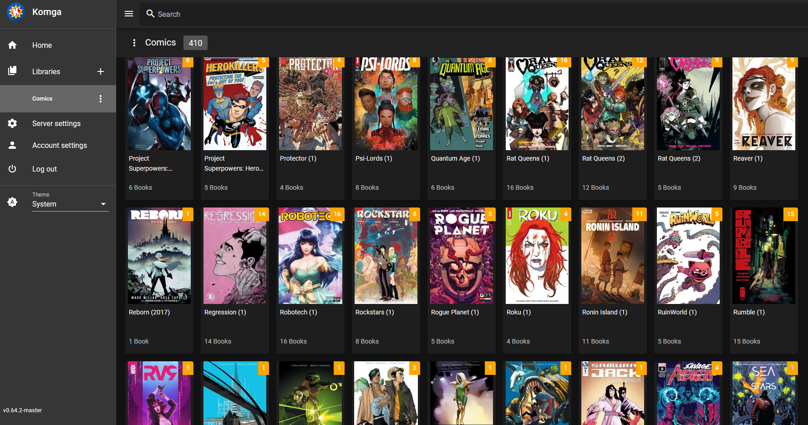

# Komga

So you've just watched a bunch of superhero movies, and you're suddenly inspired to deep-dive into the weird world of comic books? You're already rocking [AutoPirate](/recipes/autopirate/) with [Mylar](/recipes/autopirate/mylar/) and [NZBGet](/recipes/autopirate/nzbget/) to grab content, but how to manage and enjoy your growing collection?



[Komga](https://komga.org/) is a media server with a beautifully slick interface, allowing you to read your comics / manga in CBZ, CBR, PDF and epub format. Komga includes an integrated web reader, as well as a [Tachiyomi](https://tachiyomi.org/) plugin and an OPDS server for integration with other mobile apps such as [Chunky on iPad](http://chunkyreader.com/).

## Ingredients

--8<-- "recipe-standard-ingredients.md"
    * [X] [AutoPirate](/recipes/autopirate/) components (*specifically [Mylar](/recipes/autopirate/mylar/)*), for searching for, downloading, and managing comic books

## Preparation

### Setup data locations

First we create a directory to hold the komga database, logs and other persistent data:

```
mkdir /var/data/komga
```

### Setup Docker Swarm

Create a docker swarm config file in docker-compose syntax (v3), something like this:

--8<-- "premix-cta.md"

```yaml
version: "3.2"

services:
  komga:
    image: gotson/komga
    env_file: /var/data/config/komga/komga.env
    volumes:
      - /var/data/media/:/media
      - /var/data/komga:/config
    deploy:
      replicas: 1
      labels:
        - traefik.enable=true
        - traefik.frontend.rule=Host:komga.example.com
        - traefik.port=8080
        - traefik.frontend.auth.forward.address=http://traefik-forward-auth:4181
        - traefik.frontend.auth.forward.authResponseHeaders=X-Forwarded-User
        - traefik.frontend.auth.forward.trustForwardHeader=true
        - traefik.docker.network=traefik_public
    networks:
      - traefik_public

networks:
  traefik_public:
    external: true
```

## Serving

### Avengers Assemble!

Launch the Komga stack by running ```docker stack deploy komga -c <path -to-docker-compose.yml>```

Log into your new instance at https://**YOUR-FQDN**. Since it's a fresh installation, Komga will prompt you to setup a username and password, after which you'll be able to setup your library, and tweak all teh butt0ns!

### Save teh wurld!

If Komga scratches your particular itch, please join me in [sponsoring the developer](/#sponsored-projects) :heart:

[^1]: Since Komga doesn't need to communicate with any other services, we don't need a separate overlay network for it. Provided Traefik can reach Komga via the `traefik_public` overlay network, we've got all we need.

--8<-- "recipe-footer.md"