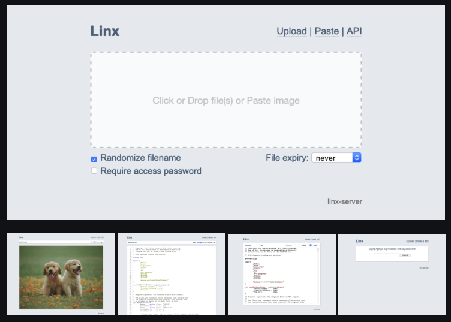

# Linx

Ever wanted to quickly share a screenshot, but don't want to use imgur, sign up for a service, or have your image tracked across the internet for all time? 

Want to privately share some log output with a password, or a self-destructing cat picture?

{: loading=lazy }

[Linx](https://github.com/andreimarcu/linx-server) is self-hosted file/media-sharing service, which features:

- :white_check_mark: Display common filetypes (*image, video, audio, markdown, pdf*)
- :white_check_mark: Display syntax-highlighted code with in-place editing
- :white_check_mark: Documented API with keys for restricting uploads
- :white_check_mark: Torrent download of files using web seeding
- :white_check_mark: File expiry, deletion key, file access key, and random filename options

--8<-- "recipe-standard-ingredients.md"

## Preparation

### Setup data locations

First we create a directory to hold the data which linx will serve:

```
mkdir /var/data/linx
```

### Create config file

Linx is configured using a flat text file, so create this on the Docker host, and then we'll mount it (*read-only*) into the container, below.

```
mkdir /var/data/config/linx
cat << EOF > /var/data/config/linx/linx.conf
# Refer to https://github.com/andreimarcu/linx-server for details
cleanup-every-minutes = 5
EOF
```

### Setup Docker Swarm

Create a docker swarm config file in docker-compose syntax (v3), something like this:

--8<-- "premix-cta.md"

```yaml
version: "3.2" # https://docs.docker.com/compose/compose-file/compose-versioning/#version-3

services:
  linx:
    image: andreimarcu/linx-server
    env_file: /var/data/config/linx/linx.env
    command: -config /linx.conf
    volumes:
      - /var/data/linx/:/files/
      - /var/data/config/linx/linx.conf:/linx.conf:ro
    deploy:
      labels:
        # traefik common
        - traefik.enable=true
        - traefik.docker.network=traefik_public

        # traefikv1
        - traefik.frontend.rule=Host:linx.example.com
        - traefik.port=8080     

        # traefikv2
        - "traefik.http.routers.linx.rule=Host(`linx.example.com`)"
        - "traefik.http.routers.linx.entrypoints=https"
        - "traefik.http.services.linx.loadbalancer.server.port=8080" 

    networks:
      - traefik_public

networks:
  traefik_public:
    external: true
```

## Serving

### Launch the Linx!

Launch the Linx stack by running ```docker stack deploy linx -c <path -to-docker-compose.yml>```


[^1]: Since the whole purpose of media/file sharing is to share stuff with **strangers**, this recipe doesn't take into account any sort of authentication using [Traefik Forward Auth](/ha-docker-swarm/traefik-forward-auth/).

--8<-- "recipe-footer.md"