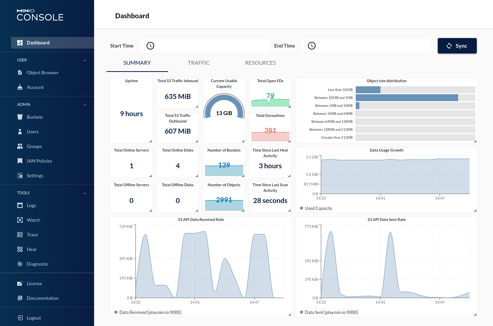

# Minio

Minio is a high performance distributed object storage server, designed for
large-scale private cloud infrastructure.

However, at its simplest, Minio allows you to expose a local filestructure via the [Amazon S3 API](https://docs.aws.amazon.com/AmazonS3/latest/API/Welcome.html). You could, for example, use it to provide access to "buckets" (folders) of data on your filestore, secured by access/secret keys, just like AWS S3. You can further interact with your "buckets" with common tools, just as if they were hosted on S3.

Under a more advanced configuration, Minio runs in distributed mode, with [features](https://docs.min.io/minio/baremetal/concepts/feature-overview.html) including high-availability, mirroring, erasure-coding, and "bitrot detection".



Possible use-cases:

1. Sharing files (_protected by user accounts with secrets_) via HTTPS, either as read-only or read-write, in such a way that the bucket could be mounted to a remote filesystem using common S3-compatible tools, like [goofys](https://github.com/kahing/goofys). Ever wanted to share a folder with friends, but didn't want to open additional firewall ports etc?
2. Simulating S3 in a dev environment
3. Mirroring an S3 bucket locally

--8<-- "recipe-standard-ingredients.md"

## Preparation

### Setup data locations

We'll need a directory to hold our minio file store. You can create a blank directory wherever you like (*I used `/var/data/minio`*), or point the `/data` volume to a pre-existing folder structure.

```bash
mkdir /var/data/minio
```

### Prepare environment

Create `minio.env`, and populate with the variables below.

```bash
MINIO_ROOT_USER=hackme
MINIO_ROOT_PASSWORD=becauseiforgottochangethepassword
MINIO_BROWSER_REDIRECT_URL=https://minio-console.example.com
MINIO_SERVER_URL=https://minio.example.com
```

!!! note "If minio redirects you to :9001"
    `MINIO_BROWSER_REDIRECT_URL` is especially important since recent versions of Minio will redirect web browsers to this URL when they hit the API directly. (*If you find yourself redirected to `http://your-minio-url:9001`, then you've not set this value correctly!*)

### Setup Docker Swarm

Create a docker swarm config file in docker-compose syntax (v3), something like this:

--8<-- "premix-cta.md"

```yaml
version: '3.2'

services:
  app:
    image: minio/minio
    env_file: /var/data/config/minio/minio.env
    volumes:
     - /var/data/minio:/data
    networks:
      - traefik_public
    deploy:
      labels:
        # traefik
        - traefik.enable=true
        - traefik.docker.network=traefik_public 

        # traefikv1
        - traefik.frontend.rule=Host:minio.example.com
        - traefik.port=9000   

        - traefik.console.frontend.rule=Host:minio-console.example.com
        - traefik.console.port=9001 

        # traefikv2 (death-by-labels, much?)
        - traefik.http.middlewares.redirect-https.redirectScheme.scheme=https
        - traefik.http.middlewares.redirect-https.redirectScheme.permanent=true

        - traefik.http.routers.minio-https.rule=Host(`minio.example.com`)
        - traefik.http.routers.minio-https.entrypoints=https
        - traefik.http.routers.minio-https.service=minio
        - traefik.http.routers.minio-http.rule=Host(`minio.example.com`)
        - traefik.http.routers.minio-http.entrypoints=http
        - traefik.http.routers.minio-http.middlewares=redirect-https
        - traefik.http.routers.minio-http.service=minio
        - traefik.http.services.minio.loadbalancer.server.port=9000

        - traefik.http.routers.minio-console-https.rule=Host(`minio-console.example.com`)
        - traefik.http.routers.minio-console-https.entrypoints=https
        - traefik.http.routers.minio-console-https.service=minio-console
        - traefik.http.routers.minio-console-http.rule=Host(`minio-console.example.com`)
        - traefik.http.routers.minio-console-http.entrypoints=http
        - traefik.http.routers.minio-console-http.middlewares=redirect-https
        - traefik.http.routers.minio-console-http.service=minio-console
        - traefik.http.services.minio-console.loadbalancer.server.port=9001

    command:  minio server /data --console-address ":9001"

networks:
  traefik_public:
    external: true

```

## Serving

### Launch Minio stack

Launch the Minio stack by running ``docker stack deploy minio -c <path -to-docker-compose.yml>`

Log into your new instance at `https://minio-console.**YOUR-FQDN**`, with the root user and password you specified in `minio.env`.

If you created `/var/data/minio`, you'll see nothing. If you mapped `/data` to existing data, you should see all subdirectories in your existing folder represented as buckets.

Use the Minio console to create a user, or (*ill-advisedly*) continue using the root user/password!

If all you need is single-user access to your data, you're done! 🎉

If, however, you want to expose data to multiple users, at different privilege levels, you'll need the minio client to create some users and (_potentially_) policies...

## Minio Trickz :clown:

### Setup minio client

While it's possible to fully administer Minio using the console, it's also possible using the `mc` CLI client, as illustrated below

```bash
root@ds1:~# mc config host add minio http://app:9000 admin iambatman
mc: Configuration written to `/root/.mc/config.json`. Please update your access credentials.
mc: Successfully created `/root/.mc/share`.
mc: Initialized share uploads `/root/.mc/share/uploads.json` file.
mc: Initialized share downloads `/root/.mc/share/downloads.json` file.
Added `minio` successfully.
root@ds1:~#
```

### Add (readonly) user

Use mc to add a (readonly or readwrite) user, by running ```mc admin user add minio <access key> <secret key> <access level>```

Example:

```bash
root@ds1:~# mc admin user add minio spiderman peterparker readonly
Added user `spiderman` successfully.
root@ds1:~#
```

Confirm by listing your users (_admin is excluded from the list_):

```bash
root@node1:~# mc admin user list minio
enabled    spiderman             readonly
root@node1:~#
```

### Make a bucket accessible to users

By default, all buckets have no "policies" attached to them, and so can only be accessed by the administrative user. Having created some readonly/read-write users above, you'll be wanting to grant them access to buckets.

The simplest permission scheme is "on or off". Either a bucket has a policy, or it doesn't. (_I believe you can apply policies to subdirectories of buckets in a more advanced configuration_)

After **no** policy, the most restrictive policy you can attach to a bucket is "download". This policy will allow authenticated users to download contents from the bucket. Apply the "download" policy to a bucket by running ```mc policy download minio/<bucket name>```, i.e.:

```bash
root@ds1:# mc policy download minio/comics
Access permission for `minio/comics` is set to `download`
root@ds1:#
```

### Advanced bucketing

There are some clever complexities you can achieve with user/bucket policies, including:

* A public bucket, which requires no authentication to read or even write (_for a public dropbox, for example_)
* A special bucket, hidden from most users, but available to VIP users by application of a custom "[canned policy](https://docs.minio.io/docs/minio-multi-user-quickstart-guide.html)"

### Mount a minio share remotely

Having setup your buckets, users, and policies - you can give out your minio external URL, and user access keys to your remote users, and they can S3-mount your buckets, interacting with them based on their user policy (_read-only or read/write_)

I tested the S3 mount using [goofys](https://github.com/kahing/goofys), "a high-performance, POSIX-ish Amazon S3 file system written in Go".

First, I created ~/.aws/credentials, as per the following example:

```ini
[default]
aws_access_key_id=spiderman
aws_secret_access_key=peterparker
```

And then I ran (_in the foreground, for debugging_), `goofys --f -debug_s3 --debug_fuse --endpoint=https://traefik.example.com <bucketname> <local mount point>`

To permanently mount an S3 bucket using goofys, I'd add something like this to /etc/fstab:

```bash
goofys#bucket   /mnt/mountpoint        fuse     _netdev,allow_other,--file-mode=0666    0       0
```

[^1]: There are many S3-filesystem-mounting tools available, I just picked Goofys because it's simple. Google is your friend :)
[^2]: Some applications (_like [NextCloud](/recipes/nextcloud/)_) can natively mount S3 buckets
[^3]: Some backup tools (_like [Duplicity](/recipes/duplicity/)_) can backup directly to S3 buckets

--8<-- "recipe-footer.md"
