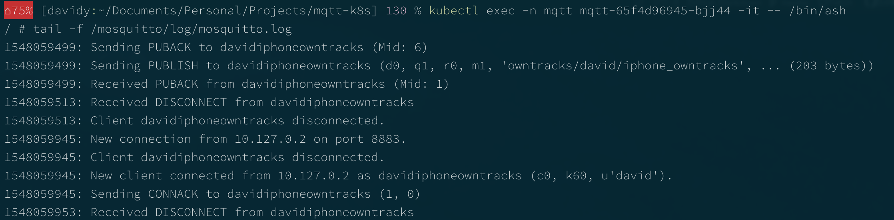

hero: Kubernetes. The hero we deserve.

!!! danger "This recipe is a work in progress"
This recipe is **incomplete**, and is featured to align the [sponsors](https://github.com/sponsors/funkypenguin)'s "premix" repository with the cookbook. "_premix_" is a private git repository available to [GitHub sponsors](https://github.com/sponsors/funkypenguin), which includes all the necessary .yml files for all published recipes. This means that sponsors can launch any recipe with just a `git pull` and a `kubectl create -f *.yml` 👍

    So... There may be errors and inaccuracies. Jump into [Discord](http://chat.funkypenguin.co.nz) if you're encountering issues 😁

# MQTT broker

I use Elias Kotlyar's [excellent custom firmware](https://github.com/EliasKotlyar/Xiaomi-Dafang-Hacks) for Xiaomi DaFang/XiaoFang cameras, enabling RTSP, MQTT, motion tracking, and other features, integrating directly with [Home Assistant](/recipes/homeassistant/).

There's currently a [mysterious bug](https://github.com/EliasKotlyar/Xiaomi-Dafang-Hacks/issues/638) though, which prevents TCP communication between Home Assistant and the camera, when MQTT services are enabled on the camera and the mqtt broker runs on the same Raspberry Pi as Home Assistant, using [Hass.io](https://www.home-assistant.io/hassio/).

A workaround to this bug is to run an MQTT broker **external** to the raspberry pi, which makes the whole problem GoAway(tm). Since an MQTT broker is a single, self-contained container, I've written this recipe as an introduction to our Kubernetes cluster design.



[MQTT](https://mqtt.org/faq) stands for MQ Telemetry Transport. It is a publish/subscribe, extremely simple and lightweight messaging protocol, designed for constrained devices and low-bandwidth, high-latency or unreliable networks. The design principles are to minimise network bandwidth and device resource requirements whilst also attempting to ensure reliability and some degree of assurance of delivery. These principles also turn out to make the protocol ideal of the emerging “machine-to-machine” (M2M) or “Internet of Things” world of connected devices, and for mobile applications where bandwidth and battery power are at a premium.

## Ingredients

1. A [Kubernetes cluster](/kubernetes/cluster/)

## Preparation

### Create data locations

Although we could simply bind-mount local volumes to a local Kubuernetes cluster, since we're targetting a cloud-based Kubernetes deployment, we only need a local path to store the YAML files which define the various aspects of our Kubernetes deployment.

```
mkdir /var/data/config/mqtt
```

### Create namespace

We use Kubernetes namespaces for service discovery and isolation between our stacks, so create a namespace for the mqtt stack by creating the following .yaml:

```
cat <<EOF > /var/data/mqtt/namespace.yml
apiVersion: v1
kind: Namespace
metadata:
  name: mqtt
EOF
kubectl create -f /var/data/mqtt/namespace.yaml
```

### Create persistent volume claim

Persistent volume claims are a streamlined way to create a persistent volume and assign it to a container in a pod. Create a claim for the certbot data:

```yaml
cat <<EOF > /var/data/mqtt/persistent-volumeclaim.yml
kind: PersistentVolumeClaim
apiVersion: v1
metadata:
  name: mqtt-volumeclaim
  namespace: mqtt
spec:
  accessModes:
    - ReadWriteOnce
  resources:
    requests:
      storage: 1Gi
EOF
kubectl create -f /var/data/mqtt/mqtt-volumeclaim.yaml
```

### Create nodeport service

I like to expose my services using nodeport (_limited to ports 30000-32767_), and then use an external haproxy load balancer to make these available externally. (_This avoids having to pay per-port changes for a loadbalancer from the cloud provider_)

```
cat <<EOF > /var/data/mqtt/service-nodeport.yml
kind: Service
apiVersion: v1
metadata:
  name: mqtt-nodeport
  namespace: mqtt
spec:
  selector:
    app: mqtt
  type: NodePort
  ports:
  - name: mqtts
    port: 8883
    protocol: TCP
    nodePort : 30883
EOF
kubectl create -f /var/data/mqtt/service-nodeport.yml
```

### Create secrets

It's not always desirable to have sensitive data stored in your .yml files. Maybe you want to check your config into a git repository, or share it. Using Kubernetes Secrets means that you can create "secrets", and use these in your deployments by name, without exposing their contents.

```
echo -n "myapikeyissosecret" > cloudflare-key.secret
echo -n "myemailaddress" > cloudflare-email.secret
echo -n "myemailaddress" > letsencrypt-email.secret

kubectl create secret -n mqtt generic mqtt-credentials \
   --from-file=cloudflare-key.secret \
   --from-file=cloudflare-email.secret \
   --from-file=letsencrypt-email.secret
```

!!! tip "Why use `echo -n`?"
Because. See [my blog post here](https://www.funkypenguin.co.nz/beware-the-hidden-newlines-in-kubernetes-secrets/) for the pain of hunting invisible newlines, that's why!

## Serving

### Create deployment

Now that we have a volume, a service, and a namespace, we can create a deployment for the mqtt pod. Note below the use of volume mounts, environment variables, as well as the secrets.

--8<-- "premix-cta.md"

```
cat <<EOF > /var/data/mqtt/mqtt.yml
apiVersion: extensions/v1beta1
kind: Deployment
metadata:
  namespace: mqtt
  name: mqtt
  labels:
    app: mqtt
spec:
  replicas: 1
  selector:
    matchLabels:
      app: mqtt
  template:
    metadata:
      labels:
        app: mqtt
    spec:
      containers:
        - image: funkypenguin/mqtt-certbot-dns
          imagePullPolicy: Always
# only uncomment these to get the container to run so that we can transfer files into the PV
#          command: [ "/bin/sleep" ]
#          args: [ "1h" ]
          env:
          - name: DOMAIN
            value: "*.funkypenguin.co.nz"
          - name: EMAIL
            valueFrom:
              secretKeyRef:
                name: mqtt-credentials
                key: letsencrypt-email.secret
          - name: CLOUDFLARE_EMAIL
            valueFrom:
              secretKeyRef:
                name: mqtt-credentials
                key: cloudflare-email.secret
          - name: CLOUDFLARE_KEY
            valueFrom:
              secretKeyRef:
                name: mqtt-credentials
                key: cloudflare-key.secret
# uncomment this to test LetsEncrypt validations
#          - name: TESTCERT
#            value: "true"
          name: mqtt
          resources:
            requests:
              memory: "50Mi"
              cpu: "0.1"
          volumeMounts:
            # We need the LE certs to persist across reboots to avoid getting rate-limited (bad, bad)
            - name: mqtt-volumeclaim
              mountPath: /etc/letsencrypt
            # A configmap for the mosquitto.conf file
            - name: mosquitto-conf
              mountPath: /mosquitto/conf/mosquitto.conf
              subPath: mosquitto.conf
            # A configmap for the mosquitto passwd file
            - name: mosquitto-passwd
              mountPath: /mosquitto/conf/passwd
              subPath: passwd
      volumes:
        - name: mqtt-volumeclaim
          persistentVolumeClaim:
            claimName: mqtt-volumeclaim
        - name: mosquitto-conf
          configMap:
            name: mosquitto.conf
        - name: mosquitto-passwd
          configMap:
            name: passwd
EOF
kubectl create -f /var/data/mqtt/mqtt.yml
```

Check that your deployment is running, with `kubectl get pods -n mqtt`. After a minute or so, you should see a "Running" pod, as illustrated below:

```
[davidy:~/Documents/Personal/Projects/mqtt-k8s] 130 % kubectl get pods -n mqtt
NAME                          READY     STATUS    RESTARTS   AGE
mqtt-65f4d96945-bjj44         1/1       Running   0          5m
[davidy:~/Documents/Personal/Projects/mqtt-k8s] %
```

To actually **use** your new MQTT broker, you'll need to connect to any one of your nodes (`kubectl get nodes -o wide`) on port 30883 (_the nodeport service we created earlier_). More info on that, and a loadbalancer design, to follow shortly :)

--8<-- "recipe-footer.md"