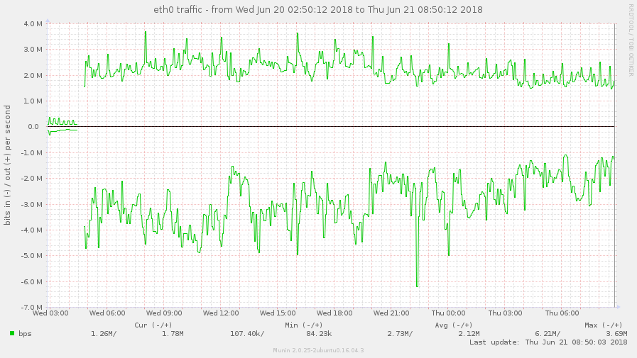

# Munin

Munin is a networked resource monitoring tool that can help analyze resource trends and "what just happened to kill our performance?" problems. It is designed to be very plug and play. A default installation provides a lot of graphs with almost no work.



Using Munin you can easily monitor the performance of your computers, networks, SANs, applications, weather measurements and whatever comes to mind. It makes it easy to determine "what's different today" when a performance problem crops up. It makes it easy to see how you're doing capacity-wise on any resources.

Munin uses the excellent ​RRDTool (written by Tobi Oetiker) and the framework is written in Perl, while plugins may be written in any language. Munin has a master/node architecture in which the master connects to all the nodes at regular intervals and asks them for data. It then stores the data in RRD files, and (if needed) updates the graphs. One of the main goals has been ease of creating new plugins (graphs).

--8<-- "recipe-standard-ingredients.md"

## Preparation

### Prepare target nodes

Depending on what you want to monitor, you'll want to install munin-node. On Ubuntu/Debian, you'll use `apt-get install munin-node`, and on RHEL/CentOS, run `yum install munin-node`. Remember to edit `/etc/munin/munin-node.conf`, and set your node to allow the server to poll it, by adding `cidr_allow x.x.x.x/x`.

On CentOS Atomic, of course, you can't install munin-node directly, but you can run it as a containerized instance. In this case, you can't use swarm since you need the container running in privileged mode, so launch a munin-node container on each atomic host using:

```
docker run -d --name munin-node --restart=always \
  --privileged --net=host \
  -v /:/rootfs:ro \
  -v /sys:/sys:ro \
  -e ALLOW="cidr_allow 0.0.0.0/0" \
  -p 4949:4949 \
  --restart=always \
  funkypenguin/munin-node
```

### Setup data locations

We'll need several directories to bind-mount into our container, so create them in /var/data/munin:

```
mkdir /var/data/munin
cd /var/data/munin
mkdir -p {log,lib,run,cache}
```

### Prepare environment

Create /var/data/config/munin/munin.env, and populate with the following variables. Use the OAUTH2 variables if you plan to use an [oauth2_proxy](/reference/oauth_proxy/) to protect munin, and set at a **minimum** the `MUNIN_USER`, `MUNIN_PASSWORD`, and `NODES` values:

```
# Use these if you plan to protect the webUI with an oauth_proxy
OAUTH2_PROXY_CLIENT_ID=
OAUTH2_PROXY_CLIENT_SECRET=
OAUTH2_PROXY_COOKIE_SECRET=

MUNIN_USER=odin
MUNIN_PASSWORD=lokiisadopted
SMTP_HOST=smtp.example.com
SMTP_PORT=587
SMTP_USERNAME=smtp-username
SMTP_PASSWORD=smtp-password
SMTP_USE_TLS=false
SMTP_ALWAYS_SEND=false
SMTP_MESSAGE='[${var:group};${var:host}] -> ${var:graph_title} -> warnings: ${loop<,>:wfields  ${var:label}=${var:value}} / criticals: ${loop<,>:cfields  ${var:label}=${var:value}}'
ALERT_RECIPIENT=monitoring@example.com
ALERT_SENDER=alerts@example.com
NODES="node1:192.168.1.1 node2:192.168.1.2 node3:192.168.1.3"
SNMP_NODES="router1:10.0.0.254:9999"
```

### Setup Docker Swarm

Create a docker swarm config file in docker-compose syntax (v3), something like this:

--8<-- "premix-cta.md"

```yaml
version: '3'

services:

  munin:
    image: funkypenguin/munin-server
    env_file: /var/data/config/munin/munin.env
    networks:
      - internal
    volumes:
      - /var/data/munin/log:/var/log/munin
      - /var/data/munin/lib:/var/lib/munin
      - /var/data/munin/run:/var/run/munin
      - /var/data/munin/cache:/var/cache/munin

  proxy:
    image: funkypenguin/oauth2_proxy
    env_file: /var/data/config/munin/munin.env
    networks:
      - traefik_public
      - internal
    deploy:
      labels:
        - traefik.frontend.rule=Host:munin.example.com
        - traefik.docker.network=traefik
        - traefik.port=4180
    command: |
      -cookie-secure=false
      -upstream=http://munin:8080
      -redirect-url=https://munin.example.com
      -http-address=http://0.0.0.0:4180
      -email-domain=example.com
      -provider=github

networks:
  traefik_public:
    external: true
  internal:
    driver: overlay
    ipam:
      config:
        - subnet: 172.16.24.0/24
```

--8<-- "reference-networks.md"

## Serving

### Launch Munin stack

Launch the Munin stack by running `docker stack deploy munin -c <path -to-docker-compose.yml>`

Log into your new instance at https://**YOUR-FQDN**, with user and password password you specified in munin.env above.

[^1]: If you wanted to expose the Munin UI directly, you could remove the oauth2_proxy from the design, and move the traefik-related labels directly to the munin container. You'd also need to add the traefik_public network to the munin container.

--8<-- "recipe-footer.md"