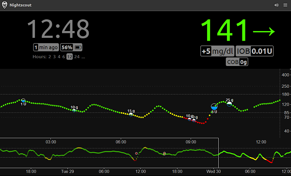

# Nightscout

Nightscout is "*...an open source, DIY project that allows real time access to a CGM data via personal website, smartwatch viewers, or apps and widgets available for smartphones*"

!!! question "Yeah, but what's a CGM?" 
    A CGM is a "continuos glucose monitor" :drop_of_blood: - If you have a blood-sugar-related disease (*i.e. diabetes*), you might wear a CGM in order to retrieve blood-glucose level readings, to inform your treatment. 
    
    NightScout frees you from the CGM's supplier's limited and proprietary app, and unlocks advanced charting, alarming, and sharing features :muscle:




[Nightscout](https://nightscout.github.io/) is _the_ standard for open-source CGM data collection, used by diabetics and those who love them, to store, share, and retrieve blood-glocuse data, in order to live healthier and happier lives. It's used as the data sharing/syncing backend for all the popular smartphone apps, including [xDrip+](https://github.com/NightscoutFoundation/xDrip) (*Android*) and [Spike App](https://spike-app.com/) (*iOS*).

Most NightScout users will deploy to Heroko, using MongoDB Atlas, which is a [well-documented solution](https://nightscout.github.io/nightscout/new_user/). If you wanted to run NightScout on your own Docker stack though, then this recipe is for you!

--8<-- "recipe-standard-ingredients.md"

## Preparation

### Setup data locations

First we create a directory to hold Nightscout's database, as well as database backups:
```
mkdir -p /var/data/runtime/nightscout/database  # excluded from automated backups
mkdir -p /var/data/nightscout/database          # included in automated backups
```

### Create env file

NightScout is configured entirely using environment variables, so create something like this as `/var/data/config/nightscout/nightscout.env`: 

!!! warning
    Your variables may vary significantly from what's illustrated below, and it's best to read up and understand exactly what each option does.

```yaml
# Customize these per https://github.com/nightscout/cgm-remote-monitor/blob/master/README.md#environment

# Required
MONGODB_URI=mongodb://db
API_SECRET=myverysecritsecrit
DISPLAY_UNITS=mmol # set to "mg/dl" if you're using US-style measurements
BASE_URL=https://nightscout.example.com

# We rely on traefik to handle SSL, so don't bother using in in nightscout
INSECURE_USE_HTTP=true

# Listen on all interfaces
HOSTNAME=::

# # Features
ENABLE=careportal basal dbsize rawbg iob maker bridge cob bwp cage iage sage boluscalc pushover treatmentnotify mmconnect loop pump profile food openaps bage alexa override cors
# DISABLE=
AUTH_DEFAULT_ROLES=denied
THEME=colors

# IMPORT_CONFIG=
# TREATMENTS_AUTH=

# # Alarms
# ALARM_TYPES=
# BG_HIGH
# BG_TARGET_TOP
# BG_TARGET_BOTTOM
# BG_LOW
# ALARM_URGENT_HIGH
# ALARM_URGENT_HIGH_MINS
# ALARM_HIGH
# ALARM_HIGH_MINS
# ALARM_LOW
# ALARM_LOW_MINS
# ALARM_URGENT_LOW
# ALARM_URGENT_LOW_MINS
# ALARM_URGENT_MINS
# ALARM_WARN_MINS

# # Core
# MONGO_TREATMENTS_COLLECTION=treatments

# Mongodb specific database dump details
BACKUP_NUM_KEEP=7
BACKUP_FREQUENCY=1d

```

### Setup Docker Swarm

Create a docker swarm config file in docker-compose syntax (v3), something like this:

--8<-- "premix-cta.md"

!!! tip
    I'm keen to share any and all resources I have with diabetics or loved-ones of diabetics (*of which I am one*). [Contact me](https://www.funkypenguin.co.nz/contact/) directly for details!

```yaml
version: '3.2'

services:

  app:
    image: nightscout/cgm-remote-monitor
    networks:
      - internal
      - traefik_public
    env_file: /var/data/config/nightscout/nightscout.env
    deploy:
      labels:
        # traefik
        - traefik.enable=true
        - traefik.docker.network=traefik_public

        # traefikv1
        - traefik.frontend.rule=Host:nightscout.example.com
        - traefik.port=1337

        # traefikv2
        - "traefik.http.routers.nightscout.rule=Host(`nightscout.example.com`)"
        - "traefik.http.routers.nightscout.entrypoints=https"
        - "traefik.http.services.nightscout.loadbalancer.server.port=1337"

  db:
    image: mongo:latest
    networks:
      - internal
    volumes:
      - /var/data/runtime/nightscout/database:/data/db

  db-backup:
    image: mongo:latest
    env_file: /var/data/config/nightscout/nightscout.env
    volumes:
      - /var/data/nightscout/database-dump:/dump
    entrypoint: |
      bash -c 'bash -s <<EOF
      trap "break;exit" SIGHUP SIGINT SIGTERM
      sleep 2m
      while /bin/true; do
        mongodump -h db --gzip --archive=/dump/dump_\`date +%d-%m-%Y"_"%H_%M_%S\`.mongo.gz
        ls -tr /dump/dump_*.mongo.gz | head -n -"$$BACKUP_NUM_KEEP" | xargs -r rm
        sleep $$BACKUP_FREQUENCY
      done
      EOF'
    networks:
      - internal
 
networks:
  traefik_public:
    external: true
  internal:
    driver: overlay
    ipam:
      config:
        - subnet: 172.16.4.0/24

```

## Serving

### Launch nightscout!

Launch the nightscout stack by running ```docker stack deploy nightscout -c <path -to-docker-compose.yml>```


[^1]: Most of the time, you'll need an app which syncs to Nightscout, and these apps won't support OIDC auth, so this recipe doesn't take into account any sort of authentication using [Traefik Forward Auth](/ha-docker-swarm/traefik-forward-auth/). Instead, NightScout is secured entirely with your `API_SECRET` above (*although it is possible to add more users once you're an admin*)

--8<-- "recipe-footer.md"