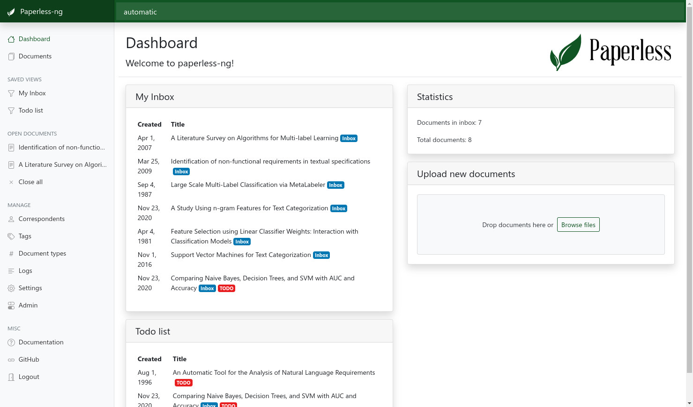

hero: Paperless NG - Index and archive all of your scanned paper documents

# Paperless NG




--8<-- "recipe-standard-ingredients.md"

## Preparation

### Setup data locations

We'll need a folder to store a docker-compose configuration file and an associated environment file. If you're following my filesystem layout, create `/var/data/config/paperless` (*for the config*). We'll also need to create `/var/data/paperless` and a few subdirectories (*for the metadata*) as follows:

```
mkdir /var/data/config/paperless
mkdir /var/data/paperless
mkdir /var/data/paperless/consume
mkdir /var/data/paperless/data
mkdir /var/data/paperless/export
mkdir /var/data/paperless/media
mkdir /var/data/paperless/pgdata
```

!!! question "Which is it, Paperless or Paperless-NG?"
    Technically the name of the application is `paperless-ng`. However, the [original     Paperless project](https://github.com/the-paperless-project/paperless) has been archived and the author recommends Paperless NG. So, to save some typing, we'll just   call it "Paperless". Additionally, if you use the automated tooling in the Premix Repo, Ansible *really* doesn't like the hypen. 

### Create environment

To stay consistent with the other recipes, we'll create a file to store environemnt variables in. There's more than 1 service in this stack, but we'll only create one one environment file that will be used by the web server (more on this later).

```
cd /var/data/config/paperless
cat << EOF > /var/data/config/mealie/mealie.env
PAPERLESS_TIME_ZONE:<timezone>
PAPERLESS_ADMIN_USER=<admin_user>
PAPERLESS_ADMIN_PASSWORD=<admin_password>
PAPERLESS_ADMIN_MAIL=<admin_email>
PAPERLESS_REDIS=redis://broker:6379
PAPERLESS_DBHOST=db
PAPERLESS_TIKA_ENABLED=1
PAPERLESS_TIKA_GOTENBERG_ENDPOINT=http://gotenberg:3000
PAPERLESS_TIKA_ENDPOINT=http://tika:9998
EOF
```
You'll need to replace some of the text in the snippet above:
* *\<timezone\>* - Replace with an entry from [the timezone database](https://en.wikipedia.org/wiki/List_of_tz_database_time_zones) (eg: America/New_York)
* *\<admin_user\>* - Username of the superuser account that will be created on first run. Without this and the *\<admin_password\>* you won't be able to log into Paperless
* *\<admin_password\>* - Password of the superuser account above.
* *\<admin_email\>* - Email address of the superuser account above.

### Setup Docker Swarm

Create a docker swarm config file in docker-compose syntax (v3), something like this:

--8<-- "premix-cta.md"

```yaml
version: "3.4"
services:
  broker:
    image: redis:6.0
    networks:
      - internal

  db:
    image: postgres:13
    volumes:
      - /var/data/paperless/pgdata:/var/lib/postgresql/data
    environment:
      POSTGRES_DB: paperless
      POSTGRES_USER: paperless
      POSTGRES_PASSWORD: paperless
    networks:
      - internal

  webserver:
    image: jonaswinkler/paperless-ng:latest
    env_file: paperless.env
    depends_on:
      - db
      - broker
      - gotenberg
      - tika
    volumes:
      - /var/data/paperless/data:/usr/src/paperless/data
      - /var/data/paperless/media:/usr/src/paperless/media
      - /var/data/paperless/export:/usr/src/paperless/export
      - /var/data/paperless/consume:/usr/src/paperless/consume
    deploy:
      replicas: 1
      labels:
        # traefik
        - traefik.enable=true
        - traefik.docker.network=traefik_public

        # traefikv1
        - traefik.frontend.rule=Host:paperless.example.com
        - traefik.port=8000    
        - traefik.frontend.auth.forward.address=http://traefik-forward-auth:4181
        - traefik.frontend.auth.forward.authResponseHeaders=X-Forwarded-User
        - traefik.frontend.auth.forward.trustForwardHeader=true        

        # traefikv2
        - "traefik.http.routers.paperless.rule=Host(`paperless.example.com`)"
        - "traefik.http.routers.paperless.entrypoints=https"
        - "traefik.http.services.paperless.loadbalancer.server.port=8000"
        - "traefik.http.routers.paperless.middlewares=forward-auth"
    networks:
      - internal
      - traefik_public

  gotenberg:
    image: thecodingmachine/gotenberg
    environment:
      DISABLE_GOOGLE_CHROME: 1
    networks:
      - internal

  tika:
    image: apache/tika
    networks:
      - internal

networks:
  traefik_public:
    external: true
  internal:
    driver: overlay
    ipam:
      config:
        - subnet: 172.16.58.0/24 

```
## Serving

Launch the paperless stack by running ```docker stack deploy paperless -c <path -to-docker-compose.yml>```. You can then log in with the username and password that you specified in the environment variables file above.

Head over to the [Paperless documentation](https://paperless-ng.readthedocs.io/en/latest) to see how to configure and use the application then revel in the fact you can now search all your scanned documents to to your heart's content.