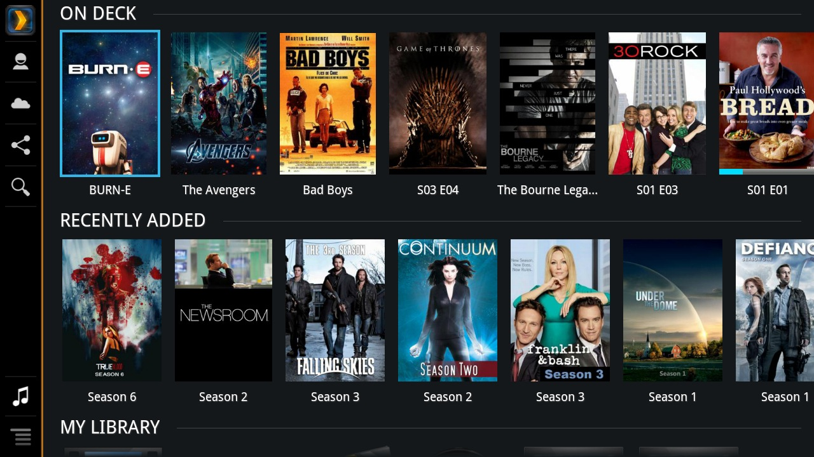

hero: A recipe to manage your Media 🎥 📺 🎵

# Plex

[Plex](https://www.plex.tv/) is a client-server media player system and software suite comprising two main components (a media server and client applications)



## Ingredients

1. [Docker swarm cluster](/ha-docker-swarm/design/) with [persistent shared storage](/ha-docker-swarm/shared-storage-ceph.md)
2. [Traefik](/ha-docker-swarm/traefik) configured per design
3. A DNS entry for the hostname you intend to use, pointed to your [keepalived](ha-docker-swarm/keepalived/) IP

## Preparation

### Setup data locations

We'll need a directories to bind-mount into our container for Plex to store its library, so create /var/data/plex:

```
mkdir /var/data/plex
```

### Prepare environment

Create plex.env, and populate with the following variables. Set PUID and GUID to the UID and GID of the user who owns your media files, on the local filesystem

```
EDGE=1
VERSION=latest
PUID=42
PGID=42
```

### Setup Docker Swarm

Create a docker swarm config file in docker-compose syntax (v3), something like this:

!!! tip
        I share (_with my [patreon patrons](https://www.patreon.com/funkypenguin)_) a private "_premix_" git repository, which includes necessary docker-compose and env files for all published recipes. This means that patrons can launch any recipe with just a ```git pull``` and a ```docker stack deploy``` 


```
version: "3.0"

services:
  plex:
    image: linuxserver/plex
    env_file: plex.env
    volumes:
      - /var/data/config/plex:/config
      - /var/data/media:/media
    deploy:
      labels:
        - traefik.frontend.rule=Host:plex.example.com
        - traefik.docker.network=traefik_public
        - traefik.port=32400
    networks:
        - traefik_public
        - internal
    ports:
      - 32469:32469
      - 32400:32400
      - 32401:32401
      - 3005:3005
      - 8324:8324
      - 1900:1900/udp
      - 32410:32410/udp
      - 32412:32412/udp
      - 32413:32413/udp
      - 32414:32414/udp

networks:
  traefik_public:
    external: true
  internal:
    driver: overlay
    ipam:
      config:
        - subnet: 172.16.16.0/24
```

!!! note
    Setup unique static subnets for every stack you deploy. This avoids IP/gateway conflicts which can otherwise occur when you're creating/removing stacks a lot. See [my list](/reference/networks/) here.


## Serving

### Launch Plex stack

Launch the Plex stack by running ```docker stack deploy plex -c <path -to-docker-compose.yml>```

Log into your new instance at https://**YOUR-FQDN** (You'll need to setup a plex.tv login for remote access / discovery to work from certain clients)

## Chef's Notes

1. Plex uses port 32400 for remote access, using your plex.tv user/password to authenticate you. The inclusion of the traefik proxy in this recipe is simply to allow you to use the web client (as opposed to a client app) by connecting directly to your instance, as opposed to browsing your media via https://plex.tv/web
2. Got an NVIDIA GPU? See [this blog post](https://www.funkypenguin.co.nz/note/gpu-transcoding-with-emby-plex-using-docker-nvidia/) re how to use your GPU to transcode your media!

### Tip your waiter (donate) 

Did you receive excellent service? Want to make your waiter happy? (_..and support development of current and future recipes!_) See the [support](/support/) page for (_free or paid)_ ways to say thank you! 

### Your comments? 
