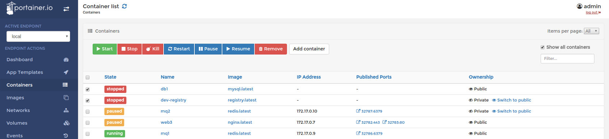
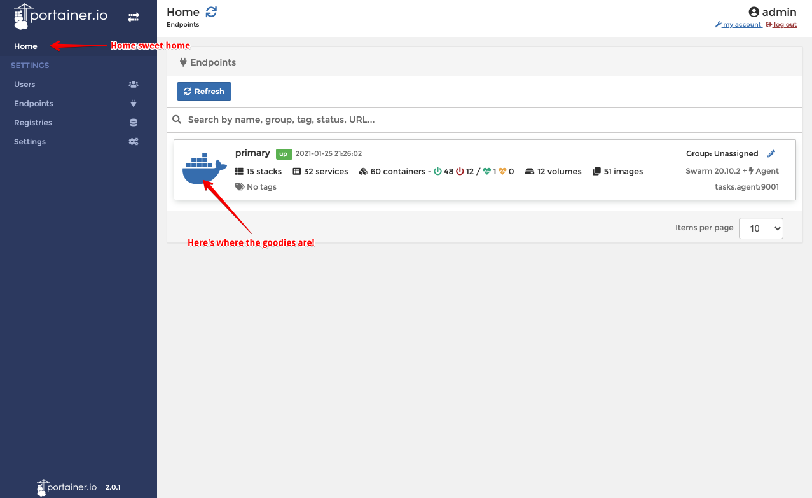

hero: A recipe for a sexy view of your Docker Swarm

# Portainer

!!! tip
    Some time after originally publishing this recipe, I had the opportunity to meet the [Portainer team](https://www.reseller.co.nz/article/682233/kiwi-startup-portainer-io-closes-1-2m-seed-round/), who are based out of Auckland, New Zealand. We now have an ongoing friendly working relationship. Portainer is my [GitHub Sponsor][github_sponsor] :heart:, and in return, I maintain their [official Kubernetes helm charts](https://github.com/portainer/k8s)! :thumbsup:

[Portainer](https://portainer.io/) is a lightweight sexy UI for visualizing your docker environment. It also happens to integrate well with Docker Swarm clusters, which makes it a great fit for our stack. 

Portainer attempts to take the "geekiness" out of containers, by wrapping all the jargon and complexity in a shiny UI and some simple abstractions. It's a great addition to any stack, especially if you're just starting your containerization journey!



--8<-- "recipe-standard-ingredients.md"

## Preparation

### Setup data locations

Create a folder to store portainer's persistent data:

```
mkdir /var/data/portainer
```

### Setup Docker Swarm

Create a docker swarm config file in docker-compose syntax (v3), something like this:

--8<-- "premix-cta.md"

```yaml
version: '3.2'

services:
  portainer:
    image: portainer/portainer-ce
    command: -H tcp://tasks.agent:9001 --tlsskipverify
    ports:
      - "9000:9000"
      - "8000:8000"
    volumes:
      - /var/data/portainer:/data
    networks:
      - internal
      - traefik_public
    deploy:
      mode: replicated
      replicas: 1
      placement:
        constraints: [node.role == manager]
      labels:
        # traefik
        - traefik.enable=true
        - traefik.docker.network=traefik_public

        # traefikv1
        - traefik.frontend.rule=Host:portainer.example.com
        - traefik.port=9000    
        # uncomment if you want to protect portainer with traefik-forward-auth using traefikv1 
        # - traefik.frontend.auth.forward.address=http://traefik-forward-auth:4181
        # - traefik.frontend.auth.forward.authResponseHeaders=X-Forwarded-User
        # - traefik.frontend.auth.forward.trustForwardHeader=true        

        # traefikv2
        - "traefik.http.routers.portainer.rule=Host(`portainer.example.com`)"
        - "traefik.http.routers.portainer.entrypoints=https"
        - "traefik.http.services.portainer.loadbalancer.server.port=9000"
        # uncomment if you want to protect portainer with traefik-forward-auth using traefikv2
        # - "traefik.http.routers.portainer.middlewares=forward-auth"

  agent:
    image: portainer/agent
    volumes:
      - /var/run/docker.sock:/var/run/docker.sock
      - /var/lib/docker/volumes:/var/lib/docker/volumes
    networks:
      - internal
    deploy:
      mode: global
      placement:
        constraints: [node.platform.os == linux]

networks:
  traefik_public:
    external: true
  internal:
    driver: overlay
    ipam:
      config:
        - subnet: 172.16.13.0/24
```

--8<-- "reference-networks.md"

!!! question "Umm.. didn't you just copy these from the [official Portainer docs](https://documentation.portainer.io/v2.0/deploy/linux/#docker-swarm)?"

    Almost word-for-word! I've made a few (*opinionated*) improvements though:

    * Expose Portainer via Traefik with valid LetsEncrypt SSL certs
    * Optionally protected Portainer's web UI with OIDC auth via Traefik Forward Auth
    * Use filesystem paths instead of Docker volumes for maximum "swarminess" (*We want an HA swarm, and HA Docker Volumes are a PITA, so we just use our [ceph shared storage](/ha-docker-swarm/shared-storage-ceph/)*)

## Serving

### Launch Portainer stack

Launch the Portainer stack by running ```docker stack deploy portainer -c <path -to-docker-compose.yml>```

Log into your new instance at https://**YOUR-FQDN**. You'll be prompted to set your admin user/password on first login. Start at "Home", and click on "Primary" to manage your swarm (*you can manage multiple swarms via one Portainer instance using the agent*):



[^1]: There are [some schenanigans](https://www.reddit.com/r/docker/comments/au9wnu/linuxserverio_templates_for_portainer/) you can do to install LinuxServer.io templates in Portainer. Don't go crying to them for support though! :crying_cat_face:

--8<-- "recipe-footer.md"