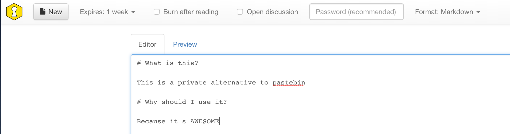

# PrivateBin

PrivateBin is a minimalist, open source online pastebin where the server (can) has zero knowledge of pasted data. We all need to paste data / log files somewhere when it doesn't make sense to paste it inline. With PasteBin, you can own the hosting, access, and eventual deletion of this data.



--8<-- "recipe-standard-ingredients.md"

## Preparation

### Setup data locations

We'll need a single location to bind-mount into our container, so create /var/data/privatebin, and make it world-writable (_there might be a more secure way to do this!_)

```
mkdir /var/data/privatebin
chmod 777 /var/data/privatebin/
```

### Setup Docker Swarm

Create a docker swarm config file in docker-compose syntax (v3), something like this:

--8<-- "premix-cta.md"

```yaml
version: '3'

services:
  app:
    image: privatebin/nginx-fpm-alpine
    volumes:
      - /var/data/privatebin:/srv/data
    networks:
      - traefik_public
    deploy:
      labels:
        - traefik.frontend.rule=Host:privatebin.example.com
        - traefik.docker.network=traefik_public
        - traefik.port=4180

networks:
  traefik_public:
    external: true
```

## Serving

### Launch PrivateBin stack

Launch the PrivateBin stack by running ```docker stack deploy privatebin -c <path -to-docker-compose.yml>```

Log into your new instance at https://**YOUR-FQDN**, with user "root" and the password you specified in gitlab.env.

[^1]: The [PrivateBin repo](https://github.com/PrivateBin/PrivateBin/blob/master/INSTALL.md) explains how to tweak configuration options, or to use a database instead of file storage, if your volume justifies it :)
[^2]: The inclusion of PrivateBin was due to the efforts of @gkoerk in our [Discord server](http://chat.funkypenguin.co.nz). Thanks Gerry!!

--8<-- "recipe-footer.md"