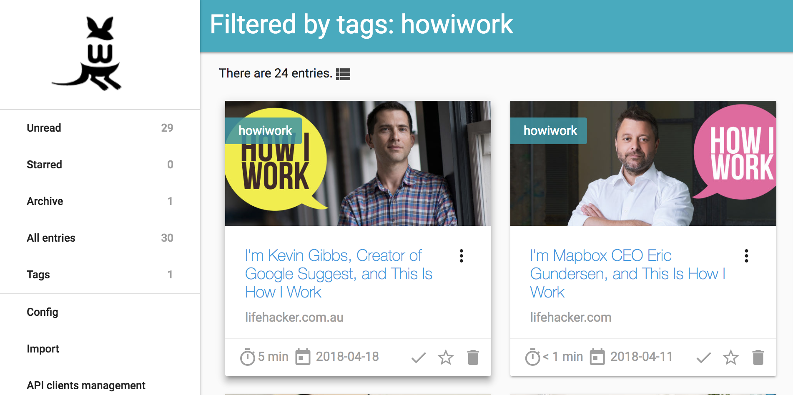

hero: Read-it-later, mate!

# Wallabag

Wallabag is a self-hosted webapp which allows you to save URLs to "read later", similar to [Instapaper](https://www.instapaper.com/u) or [Pocket](https://getpocket.com/a/). Like Instapaper (_but **not** Pocket, sadly_), Wallabag allows you to **annotate** any pages you grab for your own reference.

All saved data (_pages, annotations, images, tags, etc_) are stored on your own server, and can be shared/exported in a variety of formats, including ePub and PDF.



There are plugins for [Chrome](https://chrome.google.com/webstore/detail/wallabagger/gbmgphmejlcoihgedabhgjdkcahacjlj) and [Firefox](https://addons.mozilla.org/firefox/addon/wallabagger/), as well as apps for [iOS](https://appsto.re/fr/YeqYfb.i), [Android](https://play.google.com/store/apps/details?id=fr.gaulupeau.apps.InThePoche), etc. Wallabag will also integrate nicely with my favorite RSS reader,  [Miniflux](https://miniflux.net/) (_for which there is an [existing recipe](/recipes/miniflux)_).

[Here's a video](https://player.vimeo.com/video/167435064) which shows off the UI a bit more.

--8<-- "recipe-standard-ingredients.md"

## Preparation

### Setup data locations

We need a filesystem location to store images that Wallabag downloads from the original sources, to re-display when you read your articles, as well as nightly database dumps (_which you **should [backup](/recipes/duplicity/)**_), so create something like this:

```
mkdir -p /var/data/wallabag
cd /var/data/wallabag
mkdir -p {images,db-dump}
```

### Prepare environment

Create wallabag.env, and populate with the following variables. The only variable you **have** to change is SYMFONY__ENV__DOMAIN_NAME - this **must** be the URL that your Wallabag instance will be available at (_else you'll have no CSS_)
```
# For the DB container
POSTGRES_PASSWORD=wallabag
POSTGRES_USER=wallabag

# For the wallabag container
SYMFONY__ENV__DATABASE_DRIVER=pdo_pgsql
SYMFONY__ENV__DATABASE_HOST=db
SYMFONY__ENV__DATABASE_PORT=5432
SYMFONY__ENV__DATABASE_NAME=wallabag
SYMFONY__ENV__DATABASE_USER=wallabag
SYMFONY__ENV__DATABASE_PASSWORD=wallabag
SYMFONY__ENV__DOMAIN_NAME=https://wallabag.example.com
SYMFONY__ENV__DATABASE_DRIVER_CLASS=Wallabag\CoreBundle\Doctrine\DBAL\Driver\CustomPostgreSQLDriver
SYMFONY__ENV__MAILER_HOST=127.0.0.1
SYMFONY__ENV__MAILER_USER=~
SYMFONY__ENV__MAILER_PASSWORD=~
SYMFONY__ENV__FROM_EMAIL=wallabag@example.com
SYMFONY__ENV__FOSUSER_REGISTRATION=false


# If you decide to protect wallabag with an oauth_proxy, complete these
OAUTH2_PROXY_CLIENT_ID=
OAUTH2_PROXY_CLIENT_SECRET=
OAUTH2_PROXY_COOKIE_SECRET=
```

Now create wallabag-backup.env in the same folder, with the following contents. (_This is necessary to prevent environment variables required for backup from breaking the DB container_)

```
# For database backups
PGUSER=wallabag
PGPASSWORD=wallabag
PGHOST=db
BACKUP_NUM_KEEP=7
BACKUP_FREQUENCY=1d
```


### Setup Docker Swarm

Create a docker swarm config file in docker-compose syntax (v3), something like this:

--8<-- "premix-cta.md"

```yaml
version: '3'
services:

  wallabag:
    image: wallabag/wallabag
    env_file: /var/data/config/wallabag/wallabag.env
    networks:
      - internal
    volumes:
      - /var/data/wallabag/images:/var/www/wallabag/web/assets/images

  wallabag_proxy:
   image: a5huynh/oauth2_proxy
   env_file: /var/data/config/wallabag/wallabag.env
   networks:
     - internal
     - traefik_public
   deploy:
     labels:
       - traefik.frontend.rule=Host:wallabag.example.com
       - traefik.docker.network=traefik_public
       - traefik.port=4180
   volumes:
     - /var/data/config/wallabag/authenticated-emails.txt:/authenticated-emails.txt
   command: |
     -cookie-secure=false
     -upstream=http://wallabag:80
     -redirect-url=https://wallabag.example.com
     -http-address=http://0.0.0.0:4180
     -email-domain=example.com
     -provider=github
     -authenticated-emails-file=/authenticated-emails.txt

  db:
    image: postgres
    env_file: /var/data/config/wallabag/wallabag.env
    dns_search:
      - hq.example.com
    volumes:
      - /var/data/runtime/wallabag/data:/var/lib/postgresql/data
    networks:
      - internal

  db-backup:
    image: postgres:latest
    env_file: /var/data/config/wallabag/wallabag-backup.env
    volumes:
      - /var/data/wallabag/database-dump:/dump
      - /etc/localtime:/etc/localtime:ro
    entrypoint: |
      bash -c 'bash -s <<EOF
      trap "break;exit" SIGHUP SIGINT SIGTERM
      sleep 2m
      while /bin/true; do
        pg_dump -Fc > /dump/dump_\`date +%d-%m-%Y"_"%H_%M_%S\`.psql
        (ls -t /dump/dump*.psql|head -n $$BACKUP_NUM_KEEP;ls /dump/dump*.psql)|sort|uniq -u|xargs rm -- {}
        sleep $$BACKUP_FREQUENCY
      done
      EOF'
    networks:
    - internal

  redis:
    image: redis:alpine
    networks:
      - internal

  import-instapaper:
    image: wallabag/wallabag
    env_file: /var/data/config/wallabag/wallabag.env
    networks:
      - internal
    command: |
      import instapaper

  import-pocket:
    image: wallabag/wallabag
    env_file: /var/data/config/wallabag/wallabag.env
    networks:
      - internal
    command: |
      import pocket

networks:
  traefik_public:
    external: true
  internal:
    driver: overlay
    ipam:
      config:
        - subnet: 172.16.21.0/24
```

--8<-- "reference-networks.md"

## Serving

### Launch Wallabag stack

Launch the Wallabag stack by running ```docker stack deploy wallabag -c <path -to-docker-compose.yml>```

Log into your new instance at https://**YOUR-FQDN**, with user "wallabag" and default password "wallabag".

### Enable asynchronous imports

You'll have noticed redis, plus the pocket/instapaper-importing containers included in the .yml above. Redis is there to allow [asynchronous](https://github.com/wallabag/doc/blob/master/en/admin/asynchronous.md) imports, and pocket and instapaper are there since they're likely the most popular platform you'd _want_ to import from. Other possibilities (_you'll need to adjust the .yml_) are **readability**, **firefox**, **chrome**, and **wallabag_v1** and **wallabag_v2**.

Even with all these elements in place, you still need to enable Redis under Internal Settings -> Import, via the **admin** user in the webUI. Here's a screenshot to help you find it:


[^1]: If you wanted to expose the Wallabag UI directly (_required for the iOS/Android apps_), you could remove the oauth2_proxy from the design, and move the traefik-related labels directly to the wallabag container. You'd also need to add the traefik_public network to the wallabag container. I found the iOS app to be unreliable and clunky, so elected to leave my oauth_proxy enabled, and to simply use the webUI on my mobile devices instead. YMMMV.
[^2]: I've not tested the email integration, but you'd need an SMTP server listening on port 25 (_since we can't change the port_) to use it

--8<-- "recipe-footer.md"