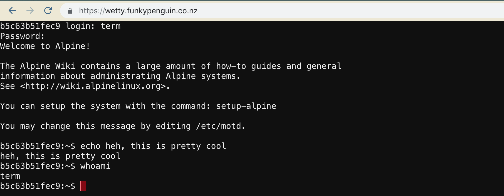

hero: Terminal in a browser, baby! 💻

# Wetty

[Wetty](https://github.com/krishnasrinivas/wetty) is a responsive, modern terminal, in your web browser. Yes, your browser. When combined with secure authentication and SSL encryption, it becomes a useful tool for quick and easy remote access.



## Why would you need SSH in a browser window?

Need shell access to a node with no external access? Deploy Wetty behind an [oauth_proxy](/reference/oauth_proxy/) with a SSL-terminating reverse proxy ([traefik](/ha-docker-swarm/traefik/)), and suddenly you have the means to SSH to your private host from any web browser (_protected by your [oauth_proxy](/reference/oauth_proxy/) of course, and your OAuth provider's 2FA_)

Here are some other possible use cases:

1. Access to SSH / CLI from an environment where outgoing SSH is locked down, or SSH client isn't / can't be installed. (_i.e., a corporate network_)
2. Access to long-running processes inside a tmux session (_like [irrsi](https://irssi.org/)_)
3. Remote access to a VM / [container running Kali linux](https://github.com/offensive-security/kali-linux-docker), for penetration testing

--8<-- "recipe-standard-ingredients.md"

## Preparation

### Prepare environment

Create wetty.env, and populate with the following variables per the [oauth_proxy](/reference/oauth_proxy/) instructions:
```
OAUTH2_PROXY_CLIENT_ID=
OAUTH2_PROXY_CLIENT_SECRET=
OAUTH2_PROXY_COOKIE_SECRET=

# To use WeTTY to SSH to a host besides the (mostly useless) alpine container it comes with
SSHHOST=batcomputer.batcave.com
SSHUSER=batman
```

### Setup Docker Swarm

Create a docker swarm config file in docker-compose syntax (v3), something like this:

--8<-- "premix-cta.md"

```yaml
version: "3"
services:
  wetty:
    image: krishnasrinivas/wetty
    env_file : /var/data/config/wetty/wetty.env
    networks:
        - internal
  proxy:
    image: funkypenguin/oauth2_proxy:latest
    env_file: /var/data/config/wetty/wetty.env
    networks:
      - internal
      - traefik_public
    deploy:
      labels:
        - traefik.frontend.rule=Host:wetty.funkypenguin.co.nz
        - traefik.docker.network=traefik_public
        - traefik.port=4180
    volumes:
      - /etc/localtime:/etc/localtime:ro
      - /var/data/config/wetty/authenticated-emails.txt:/authenticated-emails.txt
    command: |
      -cookie-secure=false
      -upstream=http://wetty:3000
      -redirect-url=https://wetty.funkypenguin.co.nz
      -http-address=http://0.0.0.0:4180
      -provider=github
      -authenticated-emails-file=/authenticated-emails.txt

networks:
  traefik_public:
    external: true
  internal:
    driver: overlay
    ipam:
      config:
        - subnet: 172.16.45.0/24
```

--8<-- "reference-networks.md"

## Serving

### Launch Wetty stack

Launch the Wetty stack by running ```docker stack deploy wetty -c <path -to-docker-compose.yml>```

Browse to your new browser-cli-terminal at https://**YOUR-FQDN**. Authenticate with your OAuth provider, and then proceed to login, either to the remote host you specified (_batcomputer.batcave.com, in the example above_), or using user and password "term" to log directly into the Wetty alpine container (_from which you can establish egress SSH_)

[^1]: You could set SSHHOST to the IP of the "docker0" interface on your host, which is normally 172.17.0.1. (_Or run ```/sbin/ip route|awk '/default/ { print $3 }'``` in the container_) This would then provide you the ability to remote-manage your swarm with only web access to Wetty.
[^2]: The inclusion of Wetty was due to the efforts of @gpulido in our [Discord server](http://chat.funkypenguin.co.nz). Thanks Gabriel!

--8<-- "recipe-footer.md"