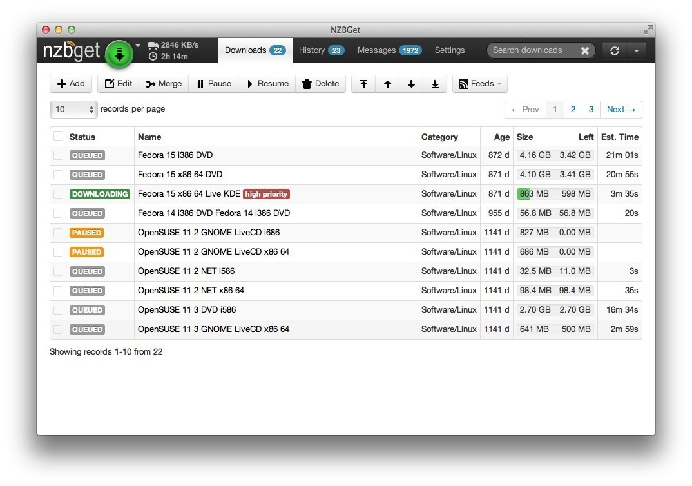

!!! warning
    This is not a complete recipe - it's a component of the [AutoPirate](/recipies/autopirate/) "_uber-recipe_", but has been split into its own page to reduce complexity.

# NZBGet

## Introduction

NZBGet performs the same function as [SABnzbd](/recipies/autopirate/sabnzbd.md) (_downloading content from Usenet servers_), but it's lightweight and fast(er), written in C++ (_as opposed to Python_).



## Inclusion into AutoPirate

To include NZBGet in your [AutoPirate](/recipies/autopirate/) stack
(_The only reason you **wouldn't** use NZBGet, would be if you were using [SABnzbd](/recipies/autopirate/sabnzbd/) instead_), include the following in your autopirate.yml stack definition file:

!!! tip
        I share (_with my [patreon patrons](https://www.patreon.com/funkypenguin)_) a private "_premix_" git repository, which includes necessary docker-compose and env files for all published recipes. This means that patrons can launch any recipe with just a ```git pull``` and a ```docker stack deploy``` 👍

```
nzbget:
  image: linuxserver/nzbget
  env_file : /var/data/config/autopirate/nzbget.env  
  volumes:
   - /var/data/autopirate/nzbget:/config
   - /var/data/media:/data
  networks:
  - internal

nzbget_proxy:
  image: zappi/oauth2_proxy
  env_file : /var/data/config/autopirate/nzbget.env
  dns_search: myswarm.example.com
  networks:
    - internal
    - traefik_public
  deploy:
    labels:
      - traefik.frontend.rule=Host:nzbget.example.com
      - traefik.docker.network=traefik_public
      - traefik.port=4180
  volumes:
    - /var/data/config/autopirate/authenticated-emails.txt:/authenticated-emails.txt
  command: |
    -cookie-secure=false
    -upstream=http://nzbget:6789
    -redirect-url=https://nzbget.example.com
    -http-address=http://0.0.0.0:4180
    -email-domain=example.com
    -provider=github
    -authenticated-emails-file=/authenticated-emails.txt
```

!!! note
    NZBGet uses a 401 header to prompt for authentication. When you use OAuth2_proxy, this seems to break. Since we trust OAuth to authenticate us, we can just disable NZGet's own authentication, by changing ControlPassword to null in nzbget.conf (i.e. ```ControlPassword=```)


## Assemble more tools..

Continue through the list of tools below, adding whichever tools your want to use, and finishing with the **[end](/recipies/autopirate/end/)** section:

* [SABnzbd](/recipies/autopirate/sabnzbd.md)
* NZBGet (this page)
* [RTorrent](/recipies/autopirate/rtorrent/)
* [Sonarr](/recipies/autopirate/sonarr/)
* [Radarr](/recipies/autopirate/radarr/)
* [Mylar](/recipies/autopirate/mylar/)
* [Lazy Librarian](/recipies/autopirate/lazylibrarian/)
* [Headphones](/recipies/autopirate/headphones/)
* [NZBHydra](/recipies/autopirate/nzbhydra/)
* [Ombi](/recipies/autopirate/ombi/)
* [Jackett](/recipies/autopirate/jackett/)
* [End](/recipies/autopirate/end/) (launch the stack)


## Chef's Notes 📓

1. In many cases, tools will integrate with each other. I.e., Radarr needs to talk to SABnzbd and NZBHydra, Ombi needs to talk to Radarr, etc. Since each tool runs within the stack under its own name, just refer to each tool by name (i.e. "radarr"), and docker swarm will resolve the name to the appropriate container. You can identify the tool-specific port by looking at the docker-compose service definition.

### Tip your waiter (donate) 

Did you receive excellent service? Want to make your waiter happy? (_..and support development of current and future recipes!_) See the [support](/support/) page for (_free or paid)_ ways to say thank you! 

### Your comments? 
