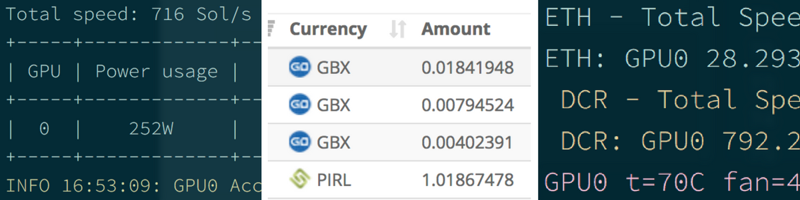

hero: We dig dig digga-dig dig!

# CryptoMiner

This is a diversion from my usual recipes - recently I've become interested in cryptocurrency, both in mining, and in investing.

I honestly didn't expect to enjoy the mining process as much as I did. Part of the enjoyment was getting my hands dirty with hardware.

Since a [mining rig](/recipies/cryptominer/mining-rig/) relies on hardware, we can't really use a docker swarm for this one!

This recipe isn't for everyone - if you just want to make some money from cryptocurrency, then you're better off learning to [invest](https://www.reddit.com/r/CryptoCurrency/) or [trade](https://www.reddit.com/r/CryptoMarkets/). However, if you want to (_ideally_) make money **and** you like tinkering, playing with hardware, optimising and monitoring, read on!

## Ingredients

1. Suitable system guts (_CPU, motherboard, RAM, PSU_) for your [mining rig](/recipies/cryptominer/mining-rig/)
2. [AMD](/recipies/cryptominer/amd-gpu/) / [Nvidia](/recipies/cryptominer/nvidia-gpu/) GPUs (_yes, plural, since although you **can** start with just one, you'll soon get hooked!_)
3. A friendly operating system ([Ubuntu](https://www.ubuntu.com/)/[Debian](https://www.debian.org/)/[CentOS7](https://www.centos.org/download/)) are known to work
4. Patience and time

## Preparation

For readability, I've split this recipe into multiple sub-recipies, which can be found below, or in the navigation links on the right-hand side:

1. Build your [mining rig](/recipies/cryptominer/mining-rig/) 💻
2. Setup your [AMD](/recipies/cryptominer/amd-gpu/) or [Nvidia](/recipies/cryptominer/nvidia-gpu/) GPUs 🎨
3. Setup your miners with [Miner Hotel](/recipies/cryptominer/minerhotel/) 🏨
4. Send your coins to [exchanges](/recipies/cryptominer/exchange/) or [wallets](/recipies/cryptominer/wallet/) 💹
5. [Monitor](/recipies/cryptominer/monitor/) your empire :heartbeat:
6. [Profit](/recipies/cryptominer/profit/)! 💰

## Chef's Notes

1. Ultimately I hope to move all the configuration / mining executables into docker containers, but for now, they're running on a CentOS7 host for direct access to GPUs. (Apparently it _may_ be possible to pass-thru the GPUs to docker containers, but I wanted stability first, before abstracting my hardware away from my miners)

### Tip your waiter (donate) 👏

Did you receive excellent service? Want to make your waiter happy? (_..and support development of current and future recipes!_) See the [support](/support/) page for (_free or paid)_ ways to say thank you! 👏

### Your comments? 💬
