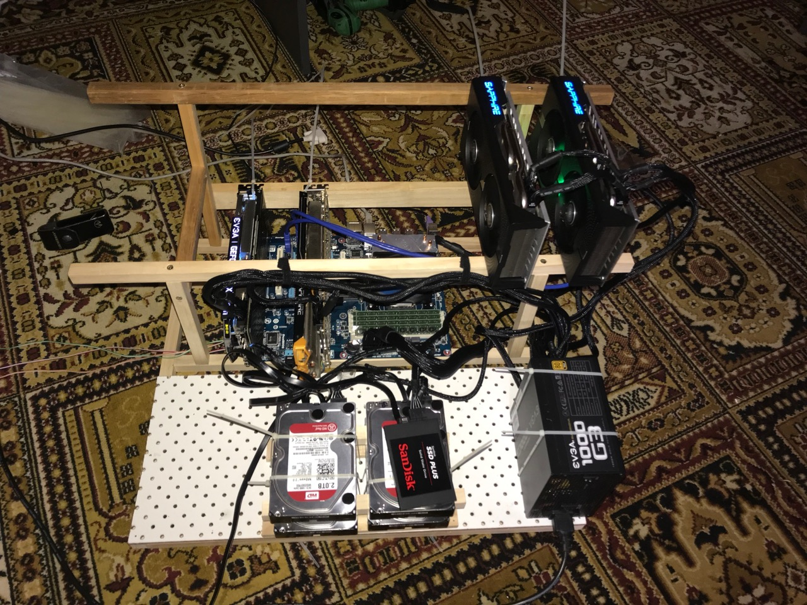

!!! warning
    This is not a complete recipe - it's a component of the [cryptominer](/recipies/cryptominer/) "_uber-recipe_", but has been split into its own page to reduce complexity.

# Mining Rig

## Hardware

You can surely [find](https://www.reddit.com/r/gpumining/) a better tutorial on how to build a mining rig than this one. However, to summarise what I've learned:

1. You want a beefy power supply, with lots of PCI-e 8pin and 6pin cables.
2. You need 1 x PCI express (_PCI-e_) port per GPU
3. You don't need powerful CPU or much RAM - the GPUs do all the mining work. My current guts (_minus the PSU_) are 5 years old.

## Do I need a open-air rig?

Initially, no. You can use any old PC chassis. But as soon as you want more than one GPU, you're going to start to run into cooling problems.

You don't need anything fancy. Here's a photo of the rig my wife built me:

I recommend this design (_with the board with little holes in it_) - it takes up more space, but I have more room to place extra components (_PSUs, hard drives, etc_), as illustrated below:

!!! note
    You'll note the hard drives in the picture - that's not part of the mining requirements, it's because my rig doubles as my [Plex](/recipies/plex/) server ;)

## Continue your adventure

Now, continue to the next stage of your grand mining adventure:

1. Build your mining rig 💻 (This page)
2. Setup your [AMD](/recipies/cryptominer/amd-gpu/) or [Nvidia](/recipies/cryptominer/nvidia-gpu/) GPUs 🎨
3. Sign up for [mining pools](/recipies/cryptominer/mining-pool/) :swimmer:
4. Setup your miners with [Miner Hotel](/recipies/cryptominer/minerhotel/) 🏨
5. Send your coins to [exchanges](/recipies/cryptominer/exchange/) or [wallets](/recipies/cryptominer/wallet/) 💹
6. [Monitor](/recipies/cryptominer/monitor/) your empire :heartbeat:
7. [Profit](/recipies/cryptominer/profit/)! 

## Chef's Notes

1. Pro-tip : You're going to spend some time overclocking. Which is going to make your mining host unstable.

Yes. It's the ultimate _#firstworldproblem_, but if you have a means to remotely reboot your host, use it! You can thank me later.

(_I hooked up a remote-controlled outlet to my rig, so that I can power-cycle it without having to crawl under the desk!_)

### Tip your waiter (donate) 

Did you receive excellent service? Want to make your waiter happy? (_..and support development of current and future recipes!_) See the [support](/support/) page for (_free or paid)_ ways to say thank you! 

### Your comments? 
