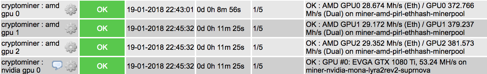

# Monitor



## Monitor your GPUs

Your mining rig is working hard to make you money. Time is money, and any downtime delays your ROI. Non-working GPUs are therefore costing you money. It's important therefor to monitor and chart your GPUs performance.

I wrote a [script](https://gist.github.com/funkypenguin/456f2b960b62409f1e977df695c62a23),
 which I use with Icinga/Nagios, to alert me if any of my GPUs are misbehaving.

!!! tip
        I share (_with my [patreon patrons](https://www.patreon.com/funkypenguin)_) a private "_premix_" git repository, which includes up-to-date copies of all supporting scripts and tools I produce, meaning patrons just run a "git pull" and they're ready to go! 👍

I use NRPE to execute the GPU-testing script, from my Icinga host (_hopefully a future recipe will cover Icinga_), with a config something like this:

```
# monitor_gpu
dont_blame_nrpe=1
command[check_gpu]=/usr/bin/sudo /opt/minerhotel/scripts/monitor-gpu.sh $ARG1$ $ARG2$
```

And the following to sudoers:

```
nrpe ALL= NOPASSWD: /opt/minerhotel/scripts/monitor-gpu.sh *
```

## Monitor your empire

So you're mining coins. How do you know how much profit you're making? How do you track your portfolio?

Here are some (affiliate) links:

* [altpocket](https://altpocket.io/?ref=ilVqdeWbAv): A WebUI to track your portfolio, syncs with Bitfinex
* [cointracking](https://cointracking.info?ref=F560640): The standard in serious crypto-investment tracking.
* [More options](https://www.cryptostache.com/2017/11/10/keeping-track-cryptocurrency-portfolio-best-apps-2017/)
>>>>>>> Stashed changes
