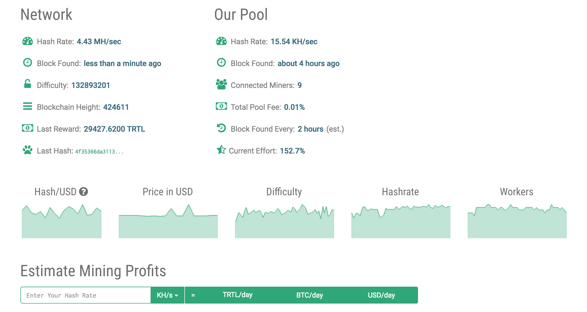

hero: How to setup a TurtleCoin Mining Pool

# TurtleCoin Mining Pool

[Cryptocurrency miners](/recipies/cryptominer) will "pool" their GPU resources ("_hashpower_") into aggregate "_mining pools_", so that by the combined effort of all the miners, the pool will receive a reward for the blocks "mined" into the blockchain, and this reward will be distributed among the miners.



This recipe illustrates how to build a mining pool for [TurtleCoin](https://turtlecoin.lol), one of many [CryptoNote](https://cryptonote.org/) [currencies](https://cryptonote.org/coins) (_which include [Monero](https://www.coingecko.com/en/coins/monero)_), but the principles can be applied to most mineable coins.

The end result is a mining pool which looks like this: https://trtl.heigh-ho.funkypenguin.co.nz/

!!! question "WTF is a TurtleCoin and why do I want it?""

    In my opinion - because it's a fun, no-BS project with a [silly origin story](https://turtlecoin.lol/#story), a [friendly, welcoming community](http://chat.turtlecoin.lol/), and you'll learn more about cryptocurrency/blockchain than you expect.

## Ingredients

1. [Docker swarm cluster](/ha-docker-swarm/design/) with [persistent shared storage](/ha-docker-swarm/shared-storage-ceph.md)
2. [Traefik](/ha-docker-swarm/traefik) configured per design
3. DNS entry for the hostnames (_pool and api_) you intend to use, pointed to your [keepalived](ha-docker-swarm/keepalived/) IP
4. At least 16GB disk space (12GB used, 4GB for future growth)

## Preparation

### Create user account

The TurtleCoin pool elements won't (_and shouldn't_) run as root, but they'll need access to write data to some parts of the filesystem (_like logs, etc_).

To manage access control, we'll want to create a local user on **each docker node** with the same UID.

```
useradd -u 3506 turtle-pool
```

!!! question "Why 3506?"
    I'm glad you asked. [TurtleCoin hard-forked at block 350K](https://medium.com/@turtlecoin/take-your-baikal-and-shove-it-up-your-asic-b05c96187790) to avoid ASIC miners. The Ninja Turtles' human friend [April O'Neil](http://turtlepedia.wikia.com/wiki/April_O'Neil) works at [Channel 6 News](http://turtlepedia.wikia.com/wiki/Channel_6). 350 + 6 = 3506 😁. Aren't **you** glad you asked?


### Setup Redis


The pool uses Redis for in-memory and persistent storage. This comes in handy for the Docker Swarm deployment, since while the various pool modules weren't _designed_ to run as microservices, the fact that they all rely on Redis for data storage makes this possible.

!!! warning "Playing it safe"

    Be aware that by default, Redis stores some data **only** in memory, and writes to the filesystem at default intervals (_can be up to 5 minutes by default_). Given we don't **want** to loose 5 minutes of miner's data if we restart Redis (_what happens if we found a block during those 5 minutes but haven't paid any miners yet?_), we want to ensure that Redis runs in "appendonly" mode, which ensures that every change is immediately written to disk.

    We also want to make sure that we retain all Redis logs persistently (_We're dealing with people's cryptocurrency here, it's a good idea to keep persistent logs for debugging/auditing_)

Create directories to hold Redis data. We use separate directories for future flexibility - One day, we may want to backup the data but not the logs, or move the data to an SSD partition but leave the logs on slower, cheaper disk.

```
mkdir -p /var/data/turtle-pool/redis/config
mkdir -p /var/data/turtle-pool/redis/data
mkdir -p /var/data/turtle-pool/redis/logs
chown turtle-pool /var/data/turtle-pool/redis/data
chown turtle-pool /var/data/turtle-pool/redis/logs
```

Create **/var/data/turtle-pool/redis/config/redis.conf** using http://download.redis.io/redis-stable/redis.conf as a guide. The following are the values I changed from default on my deployment (_but I'm not a Redis expert!_):

```
appendonly yes
appendfilename "appendonly.aof"
loglevel notice
logfile "/logs/redis.log"
```

### Setup Nginx

We'll run a simple Nginx container to serve the static front-end of the web UI.

The simplest way to get the frontend is just to clone the upstream turtle-pool repo, and mount the "/website" subdirectory into Nginx.

```
git clone https://github.com/turtlecoin/turtle-pool.git nginx/
```

Edit **/var/data/turtle-pool/nginx/website/config.js**, and change at least the following:

```
var api = "https://<CHOOSE A FQDN TO USE FOR YOUR API>";
var poolHost = "<SET TO THE PUBLIC DNS NAME FOR YOUR POOL SERVER";
```

### Setup TurtleCoin daemon

The first thing we'll need to participate in the great and powerful TurtleCoin network is a **node**. The node is responsible for communicating with the rest of the nodes in the blockchain, allowing our miners to receive new blocks to try to find.

We could simply allow your daemon to sync up with other nodes and download the entire blockchain, but it's **much** faster to download an almost-up-to-date copy of the blockchain and "[bootstrap](https://github.com/turtlecoin/turtlecoin/wiki/Bootstrapping-the-Blockchain)" your daemon. This means it'll only need to catch up on the most recent changes.

Make a directory per your filestructure standard, for the daemon to store the blockchain. The wget command chain simply downloads the zipped copy of the blockchain (1.8GB), uncompresses it (8GB), puts it where the daemon expects to find it, and deletes the unnecessary original zipfile.

```
mkdir -p /var/data/turtle-pool/daemon/.TurtleCoin
wget -O /tmp/z.$$ https://f000.backblazeb2.com/file/turtle-blockchain/latest.zip &&
   unzip -d /var/data/turtle-pool/daemon/.TurtleCoin /tmp/z.$$ &&
   rm /tmp/z.$$
chown -R turtle-pool /var/data/turtle-pool/daemon/.TurtleCoin
```

### Setup TurtleCoin wallet

Our pool needs a wallet to be able to (a) receive rewards for blocks discovered, and (b) pay out our miners for their share of the reward.

Create directories to hold wallet data

```
mkdir -p /var/data/turtle-pool/wallet/config
mkdir -p /var/data/turtle-pool/wallet/container
mkdir -p /var/data/turtle-pool/wallet/logs
chown -R turtle-pool /var/data/turtle-pool/wallet/container
chown -R turtle-pool /var/data/turtle-pool/wallet/logs
```

Now create the initial wallet. You'll want to secure your wallet password, so the command below will **prompt** you for the key (no output from the prompt), and insert it into an environment variable. This means that the key won't be stored in plaintext in your bash history!

```
read PASS
```

After having entered your password (you can confirm by running ```env | grep PASS```), run the following to run the wallet daemon _once_, with the instruction to create a new wallet container:

```
docker run \
 -v /var/data/turtle-pool/wallet/container:/container
 --rm -ti --entrypoint /usr/local/bin/walletd trtl/daemon \
 --container-file /container/wallet.container \
 --container-password $PASS \
 --generate-container
```

You'll get a lot of output. The following are relevant lines from a successful run with the extra stuff stripped out:

```
2018-May-01 11:14:57.662664 INFO    walled v0.4.3.1257 ()
2018-May-01 11:14:59.868087 INFO    Generating new wallet
2018-May-01 11:14:59.919178 INFO    Container initialized with view secret key, public view key <your view public key will be here>
2018-May-01 11:14:59.920932 INFO    New wallet added TRTL<your wallet's public address>, creation timestamp 0
2018-May-01 11:14:59.932367 INFO    Container shut down
2018-May-01 11:14:59.932419 INFO    Loading container...
2018-May-01 11:14:59.961814 INFO    Consumer added, consumer 0x55b0fb5bc070, count 1
2018-May-01 11:14:59.961996 INFO    Starting...
2018-May-01 11:14:59.962173 INFO    Container loaded, view public key <your view public key will be here>, wallet count 1, actual balance 0.00, pending balance 0.00
2018-May-01 11:14:59.962508 INFO    New wallet is generated. Address: TRTL<your wallet's public address>
2018-May-01 11:14:59.962581 INFO    Saving container...
2018-May-01 11:14:59.962683 INFO    Stopping...
2018-May-01 11:14:59.962862 INFO    Stopped
```

Take careful note of your wallet password, private view key, and wallet address (which starts with TRTL)

Create **/var/data/turtle-pool/wallet/config/wallet.conf**, containing the following:

```
bind-address = 0.0.0.0
container-file = /container/wallet.container
container-password = <ENTER YOUR CONTAINER PASSWORD HERE>
rpc-password = <CHOOSE A PASSWORD TO ALLOW POOL TO TALK TO WALLET>
log-file = /dev/stdout
log-level = 3
daemon-address = daemon
```

### Setup TurtleCoin mining pool

Following the convention we've set above, create directories to hold pool data:

```
mkdir -p /var/data/turtle-pool/pool/config
mkdir -p /var/data/turtle-pool/pool/logs
chown -R turtle-pool /var/data/turtle-pool/pool/logs
```

Now create **/var/data/turtle-pool/pool/config/config.json**, using https://github.com/turtlecoin/turtle-pool/blob/master/config.json as a guide, and adjusting at least the following:

Send logs to /logs/, so that they can potentially be stored / backed up separately from the config:

```
"logging": {
    "files": {
        "level": "debug",
        "directory": "/logs",
        "flushInterval": 5
    },
```

Set the "poolAddress" field to your wallet address
```
"poolServer": {
    "enabled": true,
    "clusterForks": "auto",
    "poolAddress": "<SET THIS TO YOUR WALLET ADDRESS GENERATED ABOVE>",
```

Add the "host" value to the api section, since our API will run on its own container, and choose a password you'll use for the webUI admin page

```
"api": {
    "enabled": true,
    "hashrateWindow": 600,
    "updateInterval": 5,
    "host": "pool-api",
    "port": 8117,
    "blocks": 30,
    "payments": 30,
    "password": "<PASSWORD FOR ADMIN PAGE ACCESS>"
```

Set the host value for the daemon:

```
"daemon": {
    "host": "daemon",
    "port": 11898
},
```

Set the host value for the wallet, and set your container password (_you recorded it earlier, remember?_)

```
"wallet": {
    "host": "wallet",
    "port": 8070,
    "password": "<SET ME TO YOUR WALLET RPC PASSWORD>"
},
```

Set the host value for Redis:

```
"redis": {
    "host": "redis",
    "port": 6379
},
```

That's it! The above config files mean each element of the pool will be able to communicate with the other elements within the docker swarm, by name.


### Setup Docker Swarm

Create a docker swarm config file in docker-compose syntax (v3), something like this:

!!! tip
        I share (_with my [patreon patrons](https://www.patreon.com/funkypenguin)_) a private "_premix_" git repository, which includes necessary docker-compose and env files for all published recipes. This means that patrons can launch any recipe with just a ```git pull``` and a ```docker stack deploy``` 👍


```
version: '3'

services:
  daemon:
    image: trtl/daemon
    user: "3506"
    volumes:
      - /var/data/turtle-pool/daemon:/daemon
      - /etc/localtime:/etc/localtime:ro
    networks:
      - traefik_public
      - internal
    deploy:
      labels:
        - traefik.frontend.rule=Host:explorer.trtl.heigh-ho.funkypenguin.co.nz
        - traefik.docker.network=traefik_public
        - traefik.port=1118
    entrypoint: |
      TurtleCoind --rpc-bind-ip=0.0.0.0 --enable_blockexplorer enable-cors=*

  pool-pool:
    image: funkypenguin/turtle-pool
    user: "3506"
    volumes:
      - /var/data/turtle-pool/pool/config:/config:ro
      - /var/data/turtle-pool/pool/logs:/logs
      - /etc/localtime:/etc/localtime:ro
    networks:
      - internal
    ports:
      - 3333:3333
      - 5555:5555
      - 7777:7777
    entrypoint: |
      node init.js -module=pool -config=/config/config.json

  pool-api:
    image: funkypenguin/turtle-pool
    user: "3506"
    volumes:
      - /var/data/turtle-pool/pool/config:/config:ro
      - /var/data/turtle-pool/pool/logs:/logs
      - /etc/localtime:/etc/localtime:ro
    networks:
      - traefik_public
      - internal
    deploy:
      labels:
        - traefik.frontend.rule=Host:api.trtl.heigh-ho.funkypenguin.co.nz
        - traefik.docker.network=traefik_public
        - traefik.port=8117
    entrypoint: |
      node init.js -module=api -config=/config/config.json

  pool-unlocker:
    image: funkypenguin/turtle-pool
    user: "3506"
    volumes:
      - /var/data/turtle-pool/pool/config:/config:ro
      - /var/data/turtle-pool/pool/logs:/logs
      - /etc/localtime:/etc/localtime:ro
    networks:
      - internal
    entrypoint: |
      node init.js -module=unlocker -config=/config/config.json

  pool-payments:
    image: funkypenguin/turtle-pool
    user: "3506"
    volumes:
      - /var/data/turtle-pool/pool/config:/config:ro
      - /var/data/turtle-pool/pool/logs:/logs
      - /etc/localtime:/etc/localtime:ro
    networks:
      - internal
    entrypoint: |
      node init.js -module=payments -config=/config/config.json

  pool-charts:
    image: funkypenguin/turtle-pool
    user: turtle-pool
    volumes:
      - /var/data/turtle-pool/pool/config:/config:ro
      - /var/data/turtle-pool/pool/logs:/logs
      - /etc/localtime:/etc/localtime:ro
    networks:
      - internal
    entrypoint: |
      node init.js -module=chartsDataCollector -config=/config/config.json

  wallet:
    image: trtl/daemon
    user: "3506"
    volumes:
      - /var/data/turtle-pool/wallet/config:/config:ro
      - /var/data/turtle-pool/wallet/container:/container
      - /var/data/turtle-pool/wallet/logs:/logs
      - /etc/localtime:/etc/localtime:ro
    networks:
      - internal
    entrypoint: |
      walletd --config /config/wallet.conf | tee /logs/walletd.log

  redis:
    volumes:
      - /var/data/turtle-pool/redis/config:/config:ro
      - /var/data/turtle-pool/redis/data:/data
      - /var/data/turtle-pool/redis/logs:/logs
      - /etc/localtime:/etc/localtime:ro
    image: redis
    entrypoint: |
      redis-server /config/redis.conf
    networks:
      - internal

  nginx:
    volumes:
      - /var/data/turtle-pool/nginx/website:/usr/share/nginx/html:ro
      - /etc/localtime:/etc/localtime:ro
    image: nginx
    networks:
      - traefik_public
      - internal
    deploy:
      labels:
        - traefik.frontend.rule=Host:trtl.heigh-ho.funkypenguin.co.nz
        - traefik.docker.network=traefik_public
        - traefik.port=80

networks:
  traefik_public:
    external: true
  internal:
    driver: overlay
    ipam:
      config:
        - subnet: 172.16.21.0/24
```

!!! note
    Setup unique static subnets for every stack you deploy. This avoids IP/gateway conflicts which can otherwise occur when you're creating/removing stacks a lot. See [my list](/reference/networks/) here.


## Serving

### Launch the Turtle! 🐢

Launch the Turtle pool stack by running ```docker stack deploy turtle-pool -c <path -to-docker-compose.yml>```, and then run ```"```docker stack ps turtle-pool``` to ensure the stack has come up properly. (_See [troubleshooting](/reference/troubleshooting) if not_)

The first thing that'll happen is that TurtleCoind will start syncing the blockchain from the bootstrap data. You can watch this happening with ```docker service logs turtle-pool_daemon -f```. While the daemon is syncing, it won't respond to requests, so walletd, the pool, etc will be non-functional.

You can watch the various elements of the pool doing their thing, by running ```tail -f /var/data/turtle-pool/pool/logs/*.log```

### So how do I mine to it?

That.. is another recipe. Start with the "[CryptoMiner](/recipes/cryptominer/)" uber-recipe for GPU/rig details, grab a copy of xmr-stack (_patched for the forked TurtleCoin_) from https://github.com/turtlecoin/trtl-stak/releases, and follow your nose. Jump into the TurtleCoin discord (_below_) #mining channel for help.

### What to do if it breaks?

TurtleCoin is a baby cryptocurrency. There are scaling issues to solve, and large amounts components of this recipe are under rapid development. So, elements may break/change in time, and this recipe itself is a work-in-progress.

Jump into the [TurtleCoin Discord server](http://chat.turtlecoin.lol/) to ask questions, contribute, and send/receive some TRTL tips!

## Chef's Notes

1. Because Docker Swarm performs ingress NAT for its load-balanced "routing mesh", the source address of inbound miner traffic is rewritten to a (_common_) docker node IP address. This means it's [not possible to determine the actual source IP address](https://github.com/moby/moby/issues/25526) of a miner. Which, in turn, means that any **one** misconfigured miner could trigger an IP ban, and lock out all other miners for 5 minutes at a time.

Two possible solutions to this are (1) disable banning, or (2) update the pool banning code to ban based on a combination of IP address and miner wallet address. I'll be working on a change to implement #2 if this becomes a concern.

2. The traefik labels in the docker-compose are to permit automatic LetsEncrypt SSL-protected proxying of your pool UI and API addresses.

### Tip your waiter (donate) 👏

Did you receive excellent service? Want to make your waiter happy? (_..and support development of current and future recipes!_) See the [support](/support/) page for (_free or paid)_ ways to say thank you! 👏

Also, you could send me some :turtle: ❤️ to _TRTLv2qCKYChMbU5sNkc85hzq2VcGpQidaowbnV2N6LAYrFNebMLepKKPrdif75x5hAizwfc1pX4gi5VsR9WQbjQgYcJm21zec4_

### Your comments? 💬
